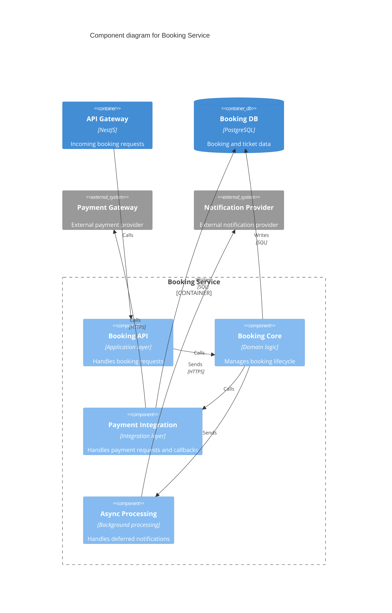

# C4 Level 3 - Component Diagram (Booking Service)

- Concern: internal structure of the Booking Service.
- Why it is separated: this view explains how booking responsibilities are split inside one container.
- Quality attributes: modifiability, reliability, and performance.
