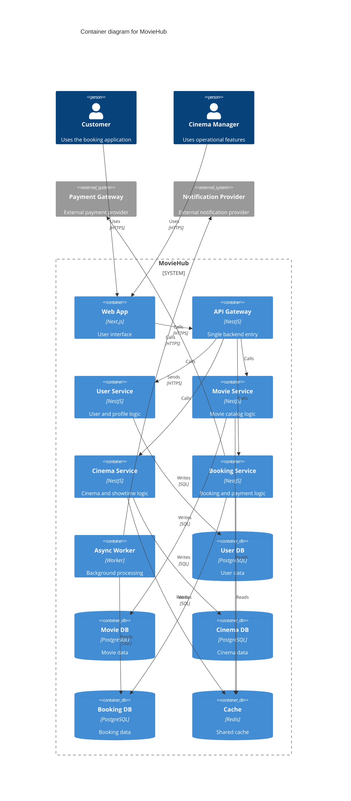

# C4 Level 2 - Container Diagram (MovieHub)

- Concern: major runtime containers and their responsibilities.
- Why it is separated: this view explains service and data boundaries without component or infrastructure detail.
- Quality attributes: modifiability, scalability, and performance.
