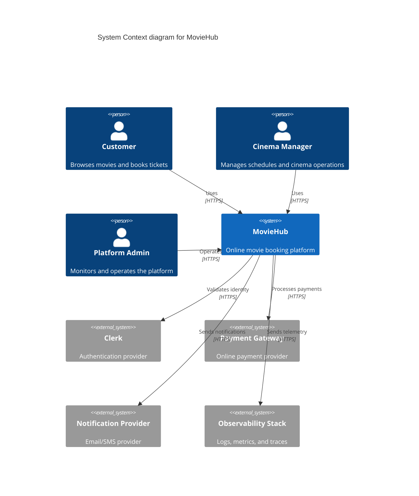

# C4 Level 1 - System Context (MovieHub)

- Concern: external actors and system boundary.
- Why it is separated: this view clarifies who interacts with MovieHub and which dependencies are outside control.
- Quality attributes: modifiability, reliability, and security.
