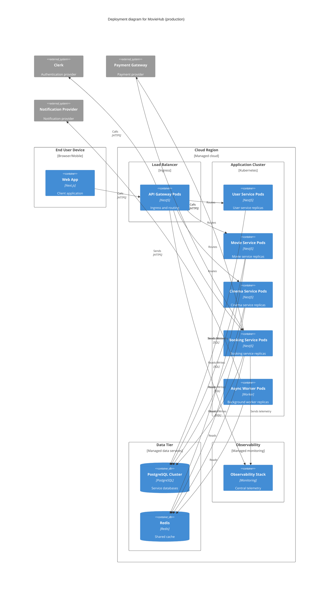

# C4 Level 4 - Deployment Diagram (MovieHub)

- Concern: production infrastructure mapping.
- Why it is separated: this view focuses on nodes, replicas, and connectivity, not business behavior.
- Quality attributes: availability, scalability, and reliability.
