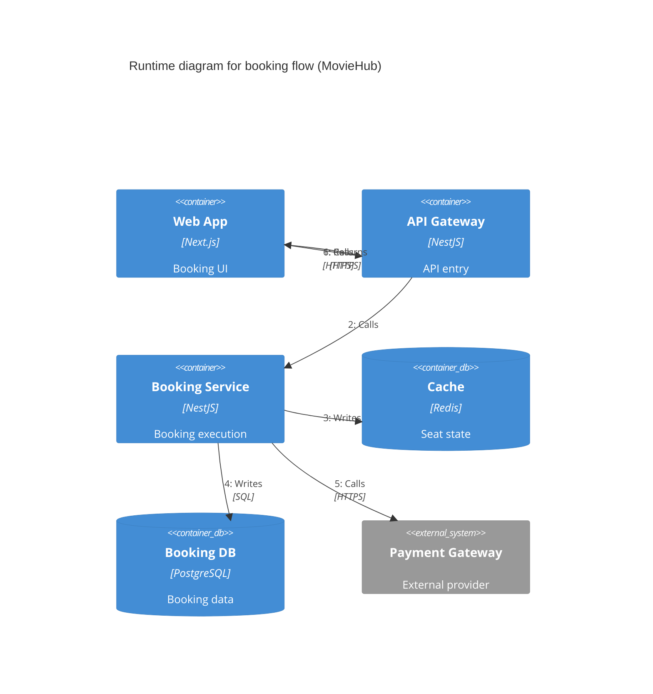

# C4 Runtime Diagram - Booking Flow

- Concern: synchronous booking path.
- Why it is separated: this is the user-critical path and must stay short and readable.
- Quality attributes: performance and reliability.
