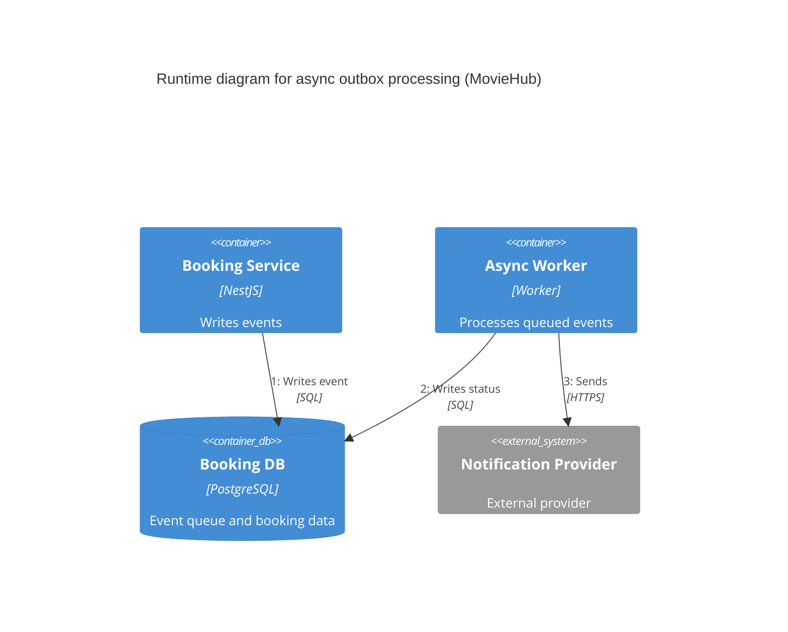

# C4 Runtime Diagram - Async Outbox Processing

- Concern: deferred event processing.
- Why it is separated: asynchronous delivery should be visible independently from synchronous booking behavior.
- Quality attributes: reliability, availability, and modifiability.
