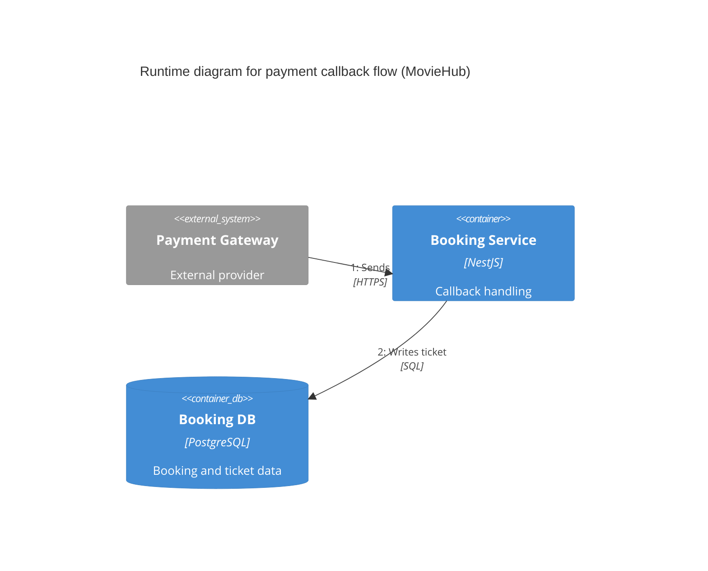

# C4 Runtime Diagram - Payment Callback Flow

- Concern: payment callback completion.
- Why it is separated: callback behavior is asynchronous and must be understood apart from the booking request path.
- Quality attributes: reliability and modifiability.
