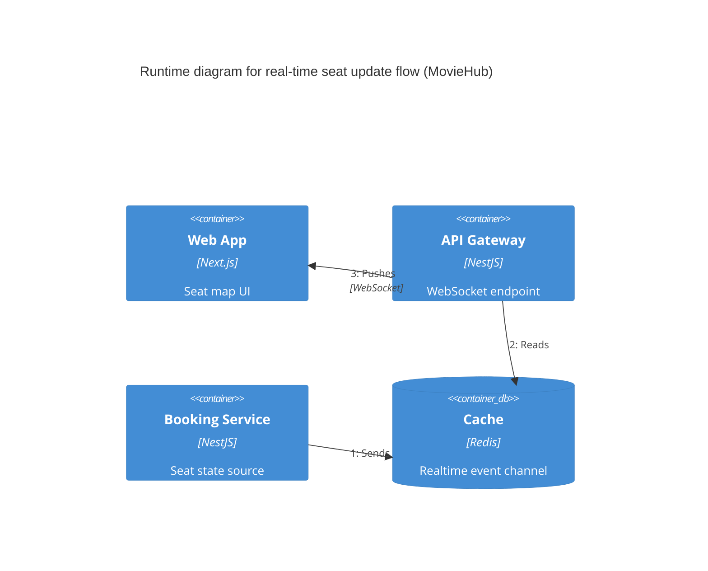

# C4 Runtime Diagram - Real-time Seat Update Flow

- Concern: realtime seat-state propagation.
- Why it is separated: realtime delivery has different scaling and latency behavior from transactional processing.
- Quality attributes: performance and scalability.
