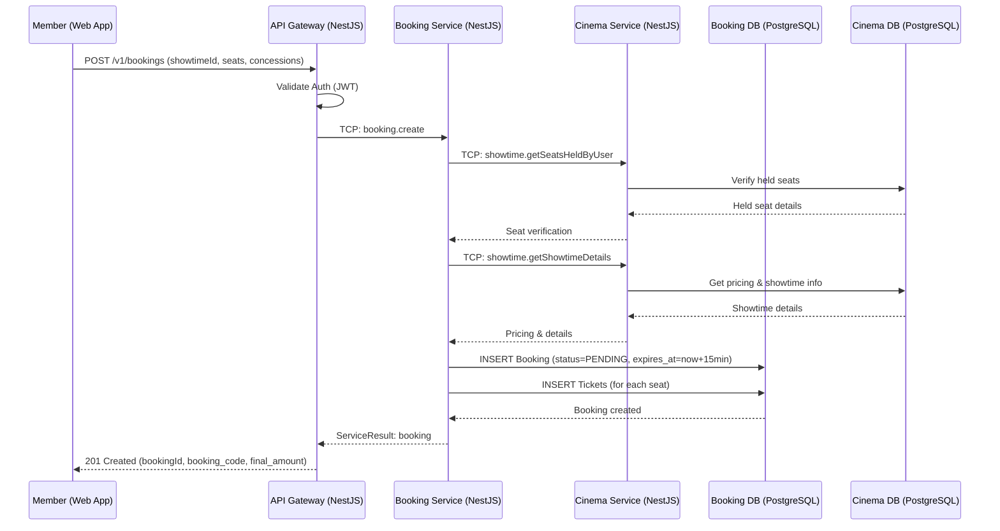

# Sequence Diagram - Booking Flow

This sequence diagram illustrates the synchronous booking creation flow in MovieHub, focusing on seat verification, pricing calculation, and PENDING booking creation. Payment initiation is a separate subsequent step.
