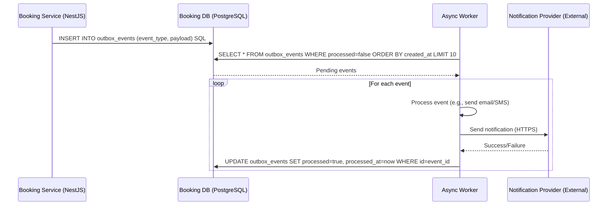

# Sequence Diagram - Async Outbox Processing

This sequence diagram depicts the asynchronous outbox pattern for reliable event processing, ensuring eventual delivery of side effects like notifications while maintaining transactional consistency.
