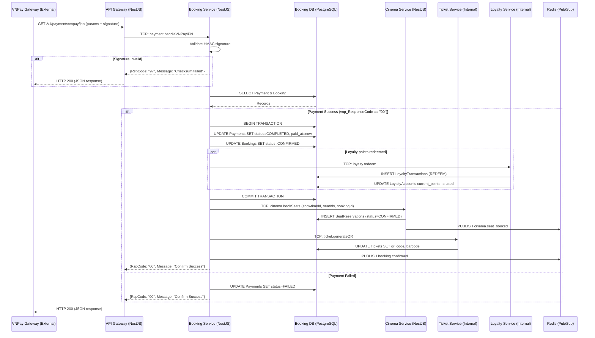

# Sequence Diagram - Payment Callback Flow

This sequence diagram illustrates the asynchronous payment callback completion flow, emphasizing reliability, idempotency, and transactional consistency as outlined in the quality attribute requirements and functional specs.
