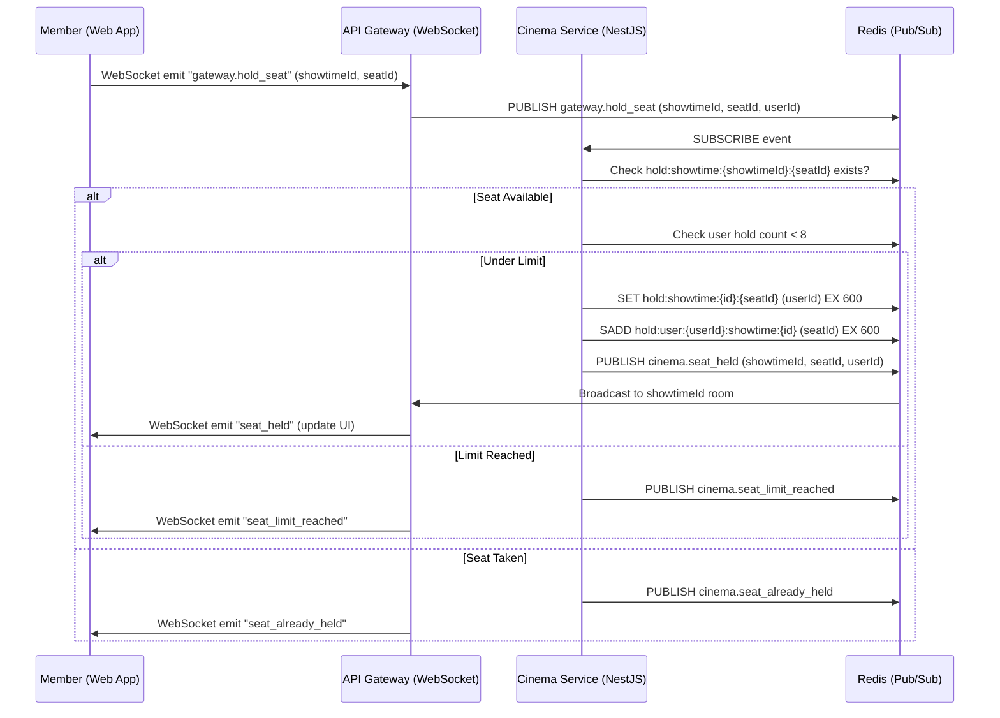

# Sequence Diagram - Real-time Seat Update Flow

This sequence diagram shows the real-time seat hold propagation using Redis Pub/Sub, highlighting performance, scalability, and concurrency control for high-concurrency seat interactions.
