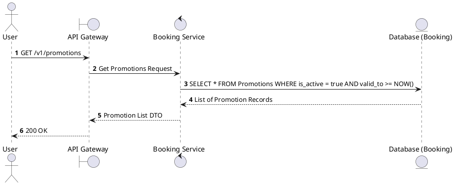
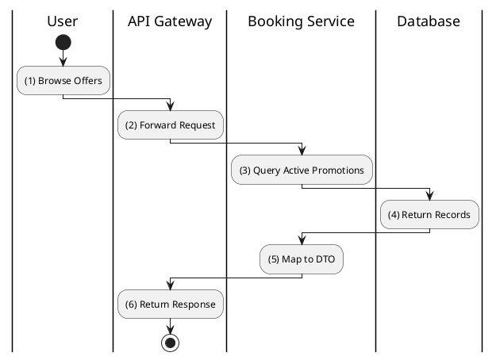

# [PM-01] List Promotions

## 1. Description

| Field | Details |
| :--- | :--- |
| **Name** | List Promotions |
| **Functional ID** | PM-01 |
| **Description** | Retrieves a list of active promotions available to the user. |
| **Actor** | Guest, Member |
| **Trigger** | `GET /v1/promotions` |
| **Pre-condition** | None. |
| **Post-condition** | List of promotions returned. |

## 2. Sequence Flow

## 3. Activity Flow

## 4. Business Rules

| Activity Step | Rule ID | Description |
| :--- | :--- | :--- |
| (3) | BR13 | A promotion is considered active if `valid_from <= NOW() <= valid_to`; only active promotions are returned. |
| (3) | BR14 | Only promotions with `is_active = true` are included in responses; inactive promotions must be excluded. |
| (3) | BR15 | Promotions must specify a type (e.g., PERCENTAGE, FIXED_AMOUNT); unknown types should be rejected with HTTP 500 or omitted from results until corrected. |
@enduml

