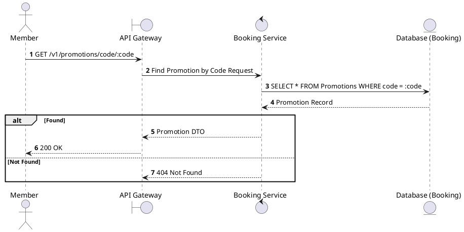
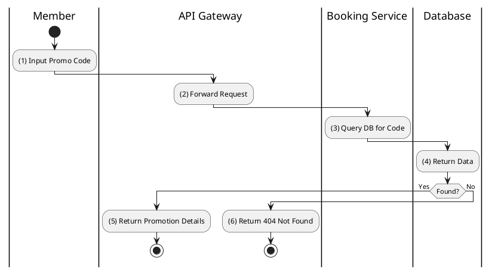

# [PM-03] Find Promotion by Code

## 1. Description

| Field | Details |
| :--- | :--- |
| **Name** | Find Promotion by Code |
| **Functional ID** | PM-03 |
| **Description** | Retrieves promotion details using a unique alphanumeric code (e.g., "SUMMER20"). |
| **Actor** | Member |
| **Trigger** | `GET /v1/promotions/code/:code` |
| **Pre-condition** | Member authenticated; Code exists. |
| **Post-condition** | Promotion details returned. |

## 2. Sequence Flow

## 3. Activity Flow

## 4. Business Rules

| Activity Step | Rule ID | Description |
| :--- | :--- | :--- |
| (3) | BR17 | Promotion code lookup must be case-insensitive; codes differing only by case map to the same promotion. |
| (3) | BR18 | A found promotion must also satisfy validity checks (e.g., active flag and `valid_from/valid_to` range); otherwise it must be treated as not found/expired. |

