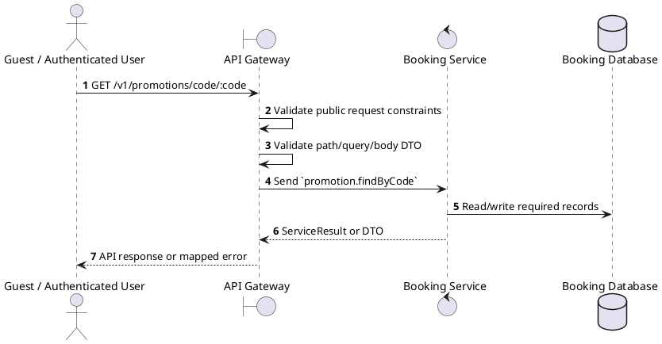
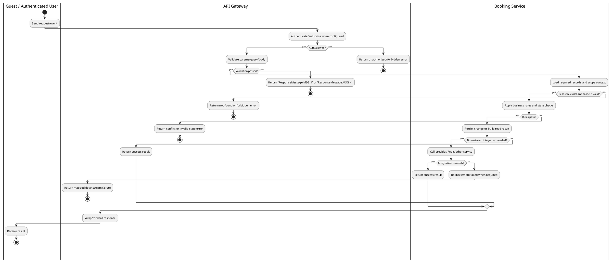

# [PM-03] Find Promotion by Code

## 1. Description

| Field | Details |
| :--- | :--- |
| **Name** | Find Promotion by Code |
| **Functional ID** | PM-03 |
| **Description** | Retrieves promotion details using a unique alphanumeric code (e.g., "SUMMER20"). |
| **Actor** | Guest / Authenticated User |
| **Trigger** | `GET /v1/promotions/code/:code` |
| **Pre-condition** | Required path/query parameters are provided; no customer session is required for this read. |
| **Post-condition** | Requested data is returned or the targeted state change is persisted consistently. |

## 2. Sequence Flow

## 3. Activity Flow

## 4. Business Rules

| Activity Step | Rule ID | Description |
| :--- | :--- | :--- |
| Gateway guard | BR-PM-03-01 | Read operation is public unless the gateway method explicitly applies ClerkAuthGuard; staff cinema context may still restrict scoped results when present. |
| Input validation | BR-PM-03-02 | Promotion create requires `code`, `name`, `type`, `value`, `validFrom`, and `validTo`; type must be PromotionType and validation requires code plus booking amount/context. |
| Route/message boundary | BR-PM-03-03 | Implemented trigger is `GET /v1/promotions/code/:code` and service boundary uses `promotion.findByCode`; the gateway must not call stale or pluralized paths that differ from the controller. |
| Business/state rule | BR-PM-03-04 | Promotion code uniqueness is enforced; duplicate code creation/update fails with `Promotion code already exists`. |
| Business/state rule | BR-PM-03-05 | Promotion validation checks active flag, validity window, min purchase, usage limits, per-user limits, and applicable conditions. |
| Business/state rule | BR-PM-03-06 | Percentage discounts are capped by configured max discount; fixed amount discounts cannot exceed the eligible purchase amount. |
| Business/state rule | BR-PM-03-07 | Public list defaults to active promotions unless `active=false`, `null`, or `undefined` is explicitly passed. |
| Integration constraint | BR-PM-03-08 | Gateway forwards the request to the target service through microservice pattern `promotion.findByCode` and propagates service errors through the common exception layer. |
| Success response | BR-PM-03-09 | Successful read operations return the requested DTO/list using the gateway's normal response wrapper; no artificial success text is invented by the spec. |
| Failure response | BR-PM-03-10 | Expected failures include `Promotion not found`, `Promotion code already exists`, inactive/expired promotion, min-purchase failure, and usage-limit failures. |
