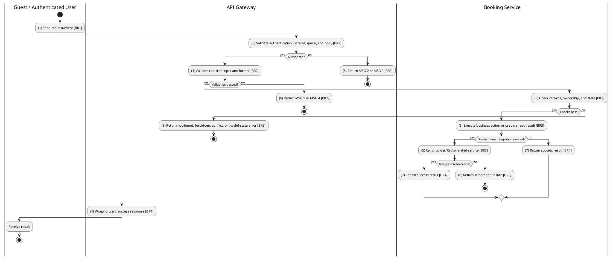
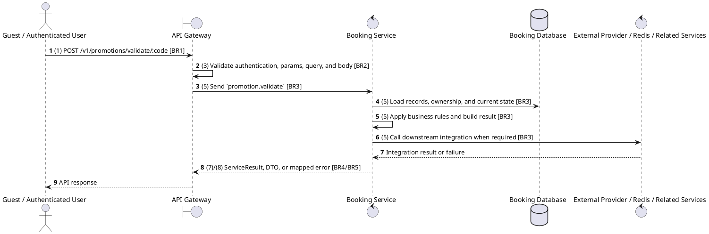

# [PM-04] Validate Promotion Code

## Use Case Description

| Field | Details |
| :--- | :--- |
| **Name** | Validate Promotion Code |
| **Description** | Validates a promotion code against a specific booking subtotal to check if it's applicable. |
| **Actor** | Guest / Authenticated User |
| **Trigger** | `POST /v1/promotions/validate/:code` |
| **Pre-condition** | Promotion code and booking amount/context are supplied; customer authentication is optional. |
| **Post-condition** | Validation result is returned without mutating promotion usage counters. |

## Activities Flow

## Sequence Flow

## Business Rules

| Activity | BR Code | Description |
| :--- | :--- | :--- |
| (1) | BR1 | Loading Screen Rules: ❖ The system loads the "Validate Promotion Code" function and receives the request/event. ❖ The system uses trigger [POST /v1/promotions/validate/:code]. |
| (3) | BR2 | Validate Rules: ❖ The system checks the items [code], [bookingAmount], [userId], [items]. ❖ The system validates data according to DTO/schema ValidatePromotionDto. ❖ Required fields: [code], [bookingAmount]. ❖ If any required entries are empty, the system shows error message MSG 1. ❖ Optional fields: [userId], [items]. ❖ Field constraint: [code] is required, type string, path parameter. ❖ Field constraint: [bookingAmount] is required, type number. ❖ Field constraint: [userId] is optional, type string. ❖ Field constraint: [items] is optional, type ValidatePromotionItemDto[], nested fields: type, id, quantity. ❖ If any type, format, enum, range, date, UUID, or email constraint is invalid, the system shows error message MSG 4. |
| (5) | BR3 | Checking Rules: ❖ Promotion code uniqueness is enforced; duplicate code creation/update fails with Promotion code already exists. ❖ Percentage discounts are capped by configured max discount; fixed amount discounts cannot exceed the eligible purchase amount. ❖ Public list defaults to active promotions unless active=false, null, or undefined is explicitly passed. |
| (7) | BR4 | Message Rules: ❖ Successful write/validation/state-changing operations return service data with MSG 7 where the service wraps a ServiceResult; pure reads return the requested DTO/list. |
| (8) | BR5 | Error Handling Rules: ❖ Gateway forwards the request to the target service through microservice pattern promotion.validate and propagates service errors through the common exception layer. ❖ Expected failures include Promotion not found, Promotion code already exists, inactive/expired promotion, min-purchase failure, and usage-limit failures. ❖ If a constraint, conflict, or unexpected failure occurs, the system shows error message MSG 9. |
