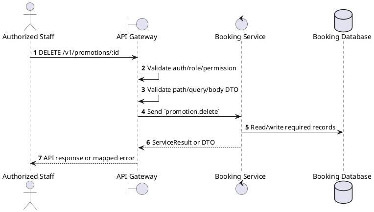
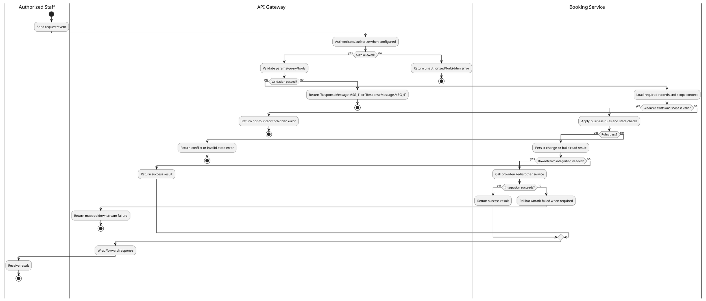

# [PM-07] Delete Promotion

## 1. Description

| Field | Details |
| :--- | :--- |
| **Name** | Delete Promotion |
| **Functional ID** | PM-07 |
| **Description** | Removes a promotion from the system. |
| **Actor** | Authorized Staff |
| **Trigger** | `DELETE /v1/promotions/:id` |
| **Pre-condition** | Caller satisfies gateway auth/permission requirements and request data matches shared DTO/query schema. |
| **Post-condition** | State change is persisted atomically or the request fails without partial data inconsistency. |

## 2. Sequence Flow

## 3. Activity Flow

## 4. Business Rules

| Activity Step | Rule ID | Description |
| :--- | :--- | :--- |
| Gateway guard | BR-PM-07-01 | Request must pass ClerkAuthGuard and the configured Permission decorator before the gateway forwards the command. |
| Input validation | BR-PM-07-02 | Promotion create requires `code`, `name`, `type`, `value`, `validFrom`, and `validTo`; type must be PromotionType and validation requires code plus booking amount/context. |
| Route/message boundary | BR-PM-07-03 | Implemented trigger is `DELETE /v1/promotions/:id` and service boundary uses `promotion.delete`; the gateway must not call stale or pluralized paths that differ from the controller. |
| Business/state rule | BR-PM-07-04 | Promotion code uniqueness is enforced; duplicate code creation/update fails with `Promotion code already exists`. |
| Business/state rule | BR-PM-07-05 | Promotion validation checks active flag, validity window, min purchase, usage limits, per-user limits, and applicable conditions. |
| Business/state rule | BR-PM-07-06 | Percentage discounts are capped by configured max discount; fixed amount discounts cannot exceed the eligible purchase amount. |
| Business/state rule | BR-PM-07-07 | Public list defaults to active promotions unless `active=false`, `null`, or `undefined` is explicitly passed. |
| Business/state rule | BR-PM-07-08 | Delete/cancel actions must be blocked when dependent records or invalid terminal states would cause data inconsistency. |
| Integration constraint | BR-PM-07-09 | Gateway forwards the request to the target service through microservice pattern `promotion.delete` and propagates service errors through the common exception layer. |
| Success response | BR-PM-07-10 | Successful write/validation/state-changing operations return service data with `ResponseMessage.MSG_7` where the service wraps a ServiceResult; pure reads return the requested DTO/list. |
| Failure response | BR-PM-07-11 | Expected failures include `Promotion not found`, `Promotion code already exists`, inactive/expired promotion, min-purchase failure, and usage-limit failures. |
