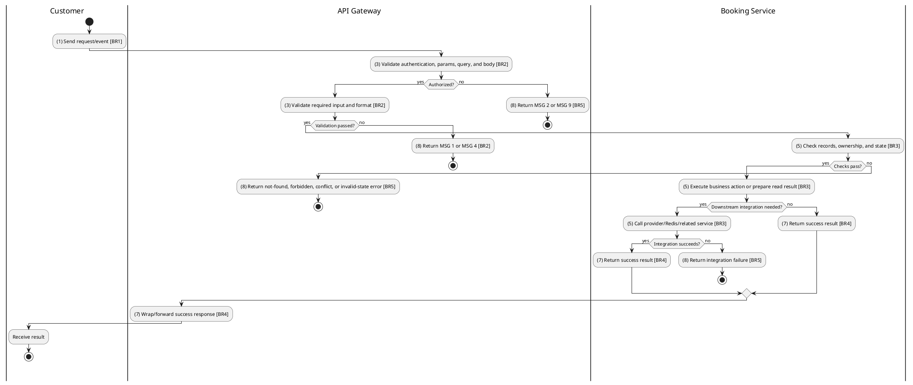
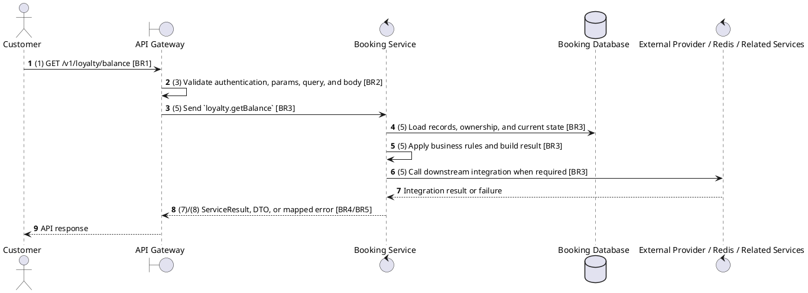

# [LY-01] Get Loyalty Balance

## Use Case Description

| Field | Details |
| :--- | :--- |
| **Name** | Get Loyalty Balance |
| **Description** | Retrieves the current loyalty points balance and membership tier for the authenticated member. |
| **Actor** | Customer |
| **Trigger** | `GET /v1/loyalty/balance` |
| **Pre-condition** | Caller satisfies gateway auth/permission requirements and request data matches shared DTO/query schema. |
| **Post-condition** | Requested data is returned or the targeted state change is persisted consistently. |

## Activities Flow

## Sequence Flow

## Business Rules

| Activity | BR Code | Description |
| :--- | :--- | :--- |
| (1) | BR1 | Loading Screen Rules: ❖ The system loads the "Get Loyalty Balance" function and receives the request/event. ❖ The system uses trigger [GET /v1/loyalty/balance]. |
| (3) | BR2 | Validate Rules: ❖ The system checks actor permission, path parameters, query values, and request body before processing. ❖ Customer request must pass ClerkAuthGuard; own-scope permissions and ownership checks prevent access to another user's booking, payment, ticket, loyalty, or refund data. ❖ Implemented trigger is GET /v1/loyalty/balance and service boundary uses loyalty.getBalance; the gateway must not call stale or pluralized paths that differ from the controller. ❖ Loyalty account is scoped to the authenticated user; users cannot read or mutate another user's balance. ❖ If any mandatory entries are empty, the system shows error message MSG 1. ❖ If request information is not in the correct format, the system shows error message MSG 4. |
| (5) | BR3 | Retrieval Rules: ❖ points must be numeric and positive for earn/redeem; type filter must be LoyaltyTransactionType and pagination uses numeric page and limit defaults. ❖ Redeem must fail with explicit Insufficient points when requested points exceed available balance. ❖ Earn/redeem operations create auditable loyalty transactions with transactionId/description when supplied. ❖ Transaction history supports type filtering and pagination while preserving chronological ordering from the service. |
| (7) | BR4 | Message Rules: ❖ Successful read operations return the requested DTO/list using the gateway's normal response wrapper; no artificial success text is invented by the spec. |
| (8) | BR5 | Error Handling Rules: ❖ Gateway forwards the request to the target service through microservice pattern loyalty.getBalance and propagates service errors through the common exception layer. ❖ Expected failures include missing loyalty account and explicit Insufficient points for redemption beyond the current balance. ❖ If a constraint, conflict, or unexpected failure occurs, the system shows error message MSG 9. |
