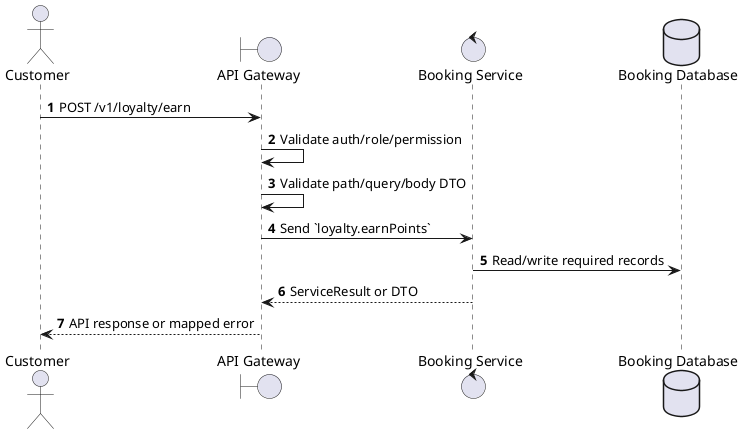
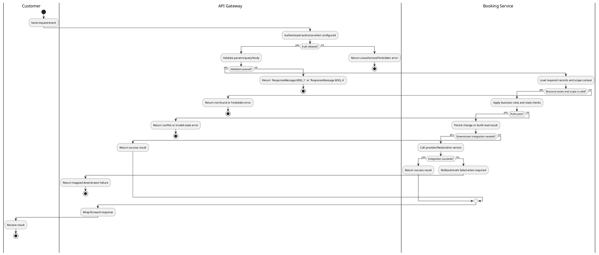

# [LY-03] Earn Points

## 1. Description

| Field | Details |
| :--- | :--- |
| **Name** | Earn Points |
| **Functional ID** | LY-03 |
| **Description** | Automatically adds loyalty points to the user's account after a successful booking confirmation. |
| **Actor** | Customer |
| **Trigger** | `POST /v1/loyalty/earn` |
| **Pre-condition** | Caller satisfies gateway auth/permission requirements and request data matches shared DTO/query schema. |
| **Post-condition** | State change is persisted atomically or the request fails without partial data inconsistency. |

## 2. Sequence Flow

## 3. Activity Flow

## 4. Business Rules

| Activity Step | Rule ID | Description |
| :--- | :--- | :--- |
| Gateway guard | BR-LY-03-01 | Customer request must pass ClerkAuthGuard; own-scope permissions and ownership checks prevent access to another user's booking, payment, ticket, loyalty, or refund data. |
| Input validation | BR-LY-03-02 | `points` must be numeric and positive for earn/redeem; `type` filter must be LoyaltyTransactionType and pagination uses numeric `page` and `limit` defaults. |
| Route/message boundary | BR-LY-03-03 | Implemented trigger is `POST /v1/loyalty/earn` and service boundary uses `loyalty.earnPoints`; the gateway must not call stale or pluralized paths that differ from the controller. |
| Business/state rule | BR-LY-03-04 | Loyalty account is scoped to the authenticated user; users cannot read or mutate another user's balance. |
| Business/state rule | BR-LY-03-05 | Redeem must fail with explicit `Insufficient points` when requested points exceed available balance. |
| Business/state rule | BR-LY-03-06 | Earn/redeem operations create auditable loyalty transactions with transactionId/description when supplied. |
| Business/state rule | BR-LY-03-07 | Transaction history supports type filtering and pagination while preserving chronological ordering from the service. |
| Integration constraint | BR-LY-03-08 | Gateway forwards the request to the target service through microservice pattern `loyalty.earnPoints` and propagates service errors through the common exception layer. |
| Success response | BR-LY-03-09 | Successful write/validation/state-changing operations return service data with `ResponseMessage.MSG_7` where the service wraps a ServiceResult; pure reads return the requested DTO/list. |
| Failure response | BR-LY-03-10 | Expected failures include missing loyalty account and explicit `Insufficient points` for redemption beyond the current balance. |
