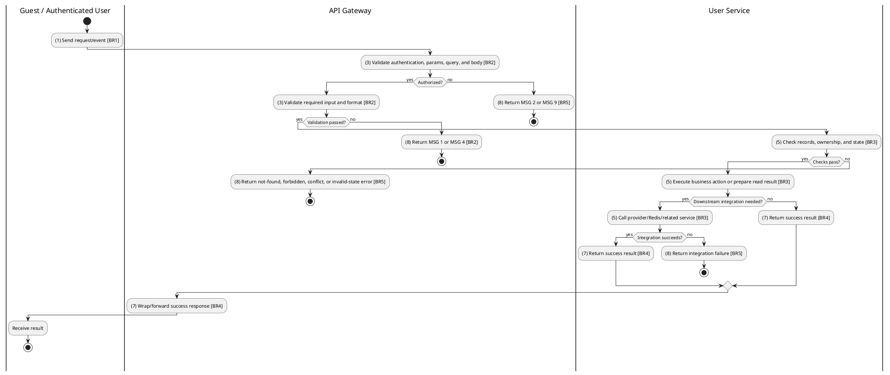
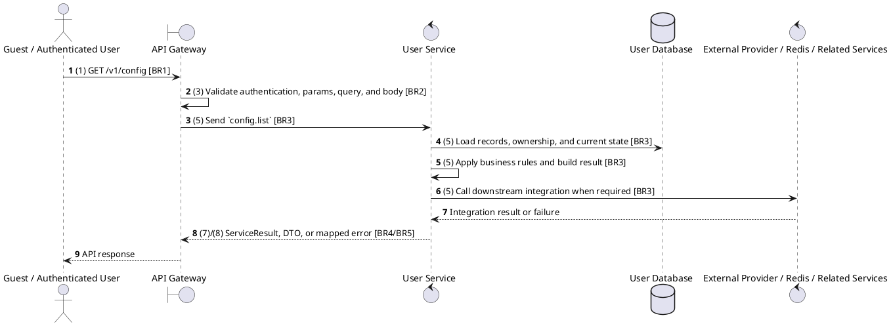

# [CF-01] Get All Settings

## Use Case Description

| Field | Details |
| :--- | :--- |
| **Name** | Get All Settings |
| **Description** | Retrieves all system-wide configuration settings and key-value pairs. |
| **Actor** | Guest / Authenticated User |
| **Trigger** | `GET /v1/config` |
| **Pre-condition** | Required path/query parameters are provided; no customer session is required for this read. |
| **Post-condition** | Requested data is returned or the targeted state change is persisted consistently. |

## Activities Flow

## Sequence Flow

## Business Rules

| Activity | BR Code | Description |
| :--- | :--- | :--- |
| (1) | BR1 | Loading Screen Rules: ❖ The system loads the "Get All Settings" function and receives the request/event. ❖ The system uses trigger [GET /v1/config]. |
| (3) | BR2 | Validate Rules: ❖ The system checks actor permission, path parameters, query values, and request body before processing. ❖ Endpoint is callable without a customer session; any staff context added by the gateway can narrow the returned data. ❖ Implemented trigger is GET /v1/config and service boundary uses config.list; the gateway must not call stale or pluralized paths that differ from the controller. ❖ Public config list returns settings intended for application configuration; update requires global config update permission. ❖ If any mandatory entries are empty, the system shows error message MSG 1. ❖ If request information is not in the correct format, the system shows error message MSG 4. |
| (5) | BR3 | Retrieval Rules: ❖ Config update requires a key and value; the :key path value and request body must target the same setting key at service level. ❖ Config values are stored as typed/JSON values and must remain compatible with consumers that read the same key. ❖ Unknown keys or invalid setting values must fail without partially changing other settings. ❖ List responses must honor supported filters, pagination defaults, and cinema/user scoping before returning data. |
| (7) | BR4 | Message Rules: ❖ Config updates return the persisted setting result and use the shared success message when the service writes data. ❖ Successful read operations return the requested DTO/list using the gateway's normal response wrapper; no artificial success text is invented by the spec. |
| (8) | BR5 | Error Handling Rules: ❖ Gateway forwards the request to the target service through microservice pattern config.list and propagates service errors through the common exception layer. ❖ Expected failures include missing/invalid config key or value, unauthorized update permission, and service/database write failure. ❖ If a constraint, conflict, or unexpected failure occurs, the system shows error message MSG 9. |
