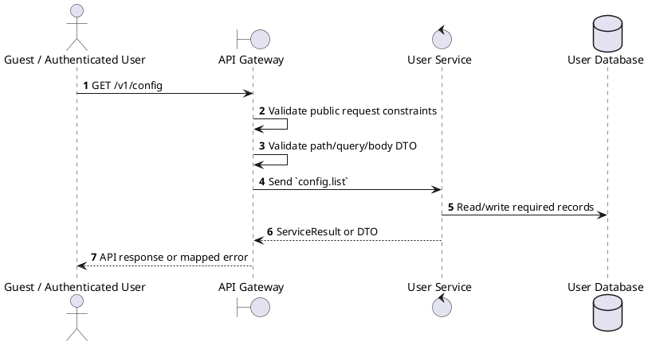
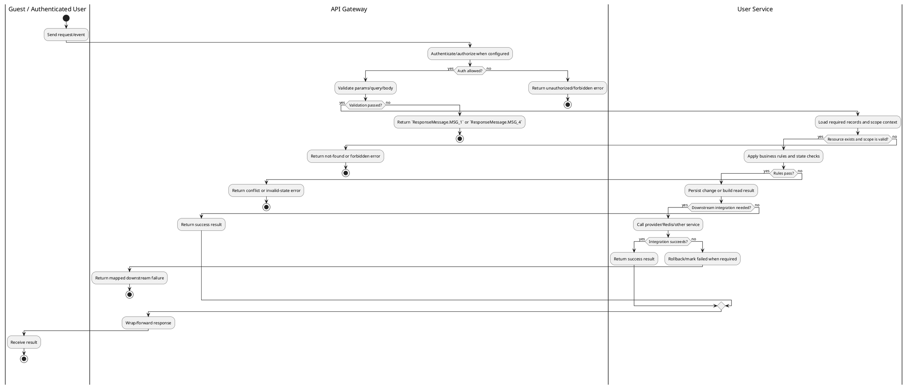

# [CF-01] Get All Settings

## 1. Description

| Field | Details |
| :--- | :--- |
| **Name** | Get All Settings |
| **Functional ID** | CF-01 |
| **Description** | Retrieves all system-wide configuration settings and key-value pairs. |
| **Actor** | Guest / Authenticated User |
| **Trigger** | `GET /v1/config` |
| **Pre-condition** | Required path/query parameters are provided; no customer session is required for this read. |
| **Post-condition** | Requested data is returned or the targeted state change is persisted consistently. |

## 2. Sequence Flow

## 3. Activity Flow

## 4. Business Rules

| Activity Step | Rule ID | Description |
| :--- | :--- | :--- |
| Gateway guard | BR-CF-01-01 | Endpoint is callable without a customer session; any staff context added by the gateway can narrow the returned data. |
| Input validation | BR-CF-01-02 | Config update requires a `key` and `value`; the `:key` path value and request body must target the same setting key at service level. |
| Route/message boundary | BR-CF-01-03 | Implemented trigger is `GET /v1/config` and service boundary uses `config.list`; the gateway must not call stale or pluralized paths that differ from the controller. |
| Business/state rule | BR-CF-01-04 | Public config list returns settings intended for application configuration; update requires global config update permission. |
| Business/state rule | BR-CF-01-05 | Config values are stored as typed/JSON values and must remain compatible with consumers that read the same key. |
| Business/state rule | BR-CF-01-06 | Unknown keys or invalid setting values must fail without partially changing other settings. |
| Business/state rule | BR-CF-01-07 | Config updates return the persisted setting result and use the shared success message when the service writes data. |
| Business/state rule | BR-CF-01-08 | List responses must honor supported filters, pagination defaults, and cinema/user scoping before returning data. |
| Integration constraint | BR-CF-01-09 | Gateway forwards the request to the target service through microservice pattern `config.list` and propagates service errors through the common exception layer. |
| Success response | BR-CF-01-10 | Successful read operations return the requested DTO/list using the gateway's normal response wrapper; no artificial success text is invented by the spec. |
| Failure response | BR-CF-01-11 | Expected failures include missing/invalid config key or value, unauthorized update permission, and service/database write failure. |
