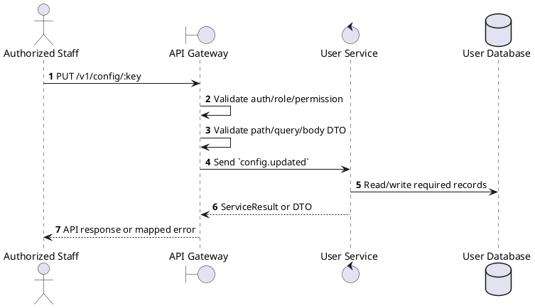
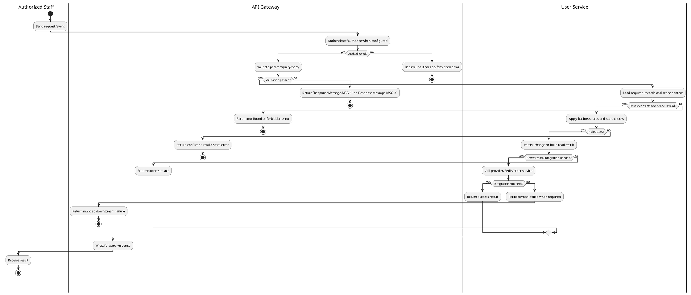

# [CF-02] Update Setting

## 1. Description

| Field | Details |
| :--- | :--- |
| **Name** | Update Setting |
| **Functional ID** | CF-02 |
| **Description** | Allows an Administrator to update the value of a specific system configuration setting. |
| **Actor** | Authorized Staff |
| **Trigger** | `PUT /v1/config/:key` |
| **Pre-condition** | Caller satisfies gateway auth/permission requirements and request data matches shared DTO/query schema. |
| **Post-condition** | State change is persisted atomically or the request fails without partial data inconsistency. |

## 2. Sequence Flow

## 3. Activity Flow

## 4. Business Rules

| Activity Step | Rule ID | Description |
| :--- | :--- | :--- |
| Gateway guard | BR-CF-02-01 | Request must pass ClerkAuthGuard and the configured Permission decorator before the gateway forwards the command. |
| Input validation | BR-CF-02-02 | Config update requires a `key` and `value`; the `:key` path value and request body must target the same setting key at service level. |
| Route/message boundary | BR-CF-02-03 | Implemented trigger is `PUT /v1/config/:key` and service boundary uses `config.updated`; the gateway must not call stale or pluralized paths that differ from the controller. |
| Business/state rule | BR-CF-02-04 | Public config list returns settings intended for application configuration; update requires global config update permission. |
| Business/state rule | BR-CF-02-05 | Config values are stored as typed/JSON values and must remain compatible with consumers that read the same key. |
| Business/state rule | BR-CF-02-06 | Unknown keys or invalid setting values must fail without partially changing other settings. |
| Business/state rule | BR-CF-02-07 | Config updates return the persisted setting result and use the shared success message when the service writes data. |
| Business/state rule | BR-CF-02-08 | Update actions must merge only allowed DTO fields and leave omitted fields unchanged. |
| Integration constraint | BR-CF-02-09 | Gateway forwards the request to the target service through microservice pattern `config.updated` and propagates service errors through the common exception layer. |
| Success response | BR-CF-02-10 | Successful write/validation/state-changing operations return service data with `ResponseMessage.MSG_7` where the service wraps a ServiceResult; pure reads return the requested DTO/list. |
| Failure response | BR-CF-02-11 | Expected failures include missing/invalid config key or value, unauthorized update permission, and service/database write failure. |
