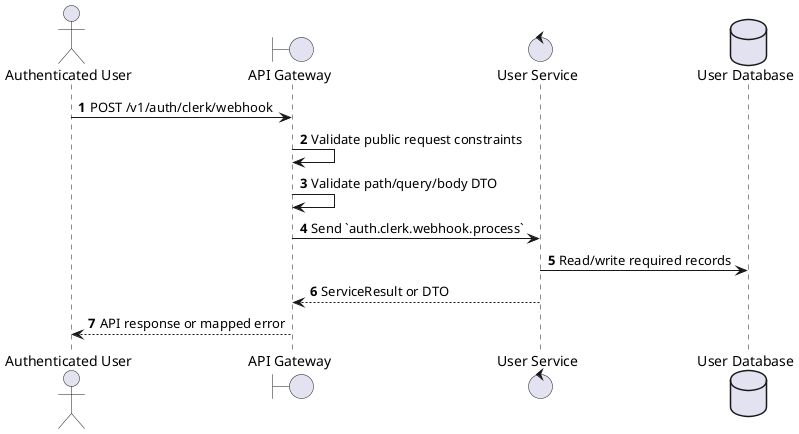
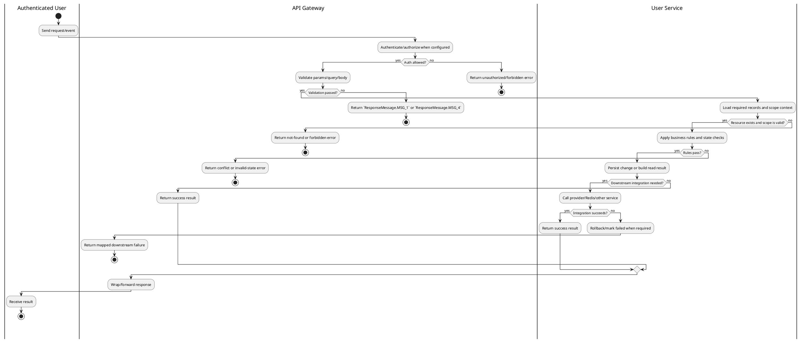

# [UM-01] User Authentication

## 1. Description

| Field | Details |
| :--- | :--- |
| **Name** | User Authentication |
| **Functional ID** | UM-01 |
| **Description** | Allows guests to sign up or log in via Clerk (external identity provider) and obtain a session token for accessing protected resources. |
| **Actor** | Authenticated User |
| **Trigger** | `POST /v1/auth/clerk/webhook` |
| **Pre-condition** | Caller satisfies gateway auth/permission requirements and request data matches shared DTO/query schema. |
| **Post-condition** | Requested data is returned or the targeted state change is persisted consistently. |

## 2. Sequence Flow

## 3. Activity Flow

## 4. Business Rules

| Activity Step | Rule ID | Description |
| :--- | :--- | :--- |
| Gateway guard | BR-UM-01-01 | Public integration endpoint; provider/webhook authenticity is verified by signature, IP whitelist, or Clerk webhook envelope instead of a user session. |
| Input validation | BR-UM-01-02 | User/staff IDs and RBAC payloads must be present; DTO/Zod validation maps missing fields to `ResponseMessage.MSG_1` and bad format to `ResponseMessage.MSG_4` when the gateway validation layer catches them. |
| Route/message boundary | BR-UM-01-03 | Implemented trigger is `POST /v1/auth/clerk/webhook` and service boundary uses `auth.clerk.webhook.process`; the gateway must not call stale or pluralized paths that differ from the controller. |
| Business/state rule | BR-UM-01-04 | User data is sourced from Clerk-synchronized records and staff context; Clerk webhook payloads must be verified before processing. |
| Business/state rule | BR-UM-01-05 | Staff managers are limited to their assigned cinema for create, view, update, and delete operations where staffContext.cinemaId is present. |
| Business/state rule | BR-UM-01-06 | RBAC and user operations require configured Permission decorators; unknown permissions, unknown roles, and removing the last ADMIN fail with explicit RBAC errors. |
| Business/state rule | BR-UM-01-07 | Staff create/update synchronizes with Clerk where configured and returns propagated errors for duplicate identity or external sync failure. |
| Integration constraint | BR-UM-01-08 | Gateway forwards the request to the target service through microservice pattern `auth.clerk.webhook.process` and propagates service errors through the common exception layer. |
| Success response | BR-UM-01-09 | Successful read operations return the requested DTO/list using the gateway's normal response wrapper; no artificial success text is invented by the spec. |
| Failure response | BR-UM-01-10 | Expected failures include staff cinema-scope ForbiddenException messages, invalid Clerk webhook envelope, unknown permissions/roles, duplicate staff identity, and `Cannot remove the last ADMIN`. |
