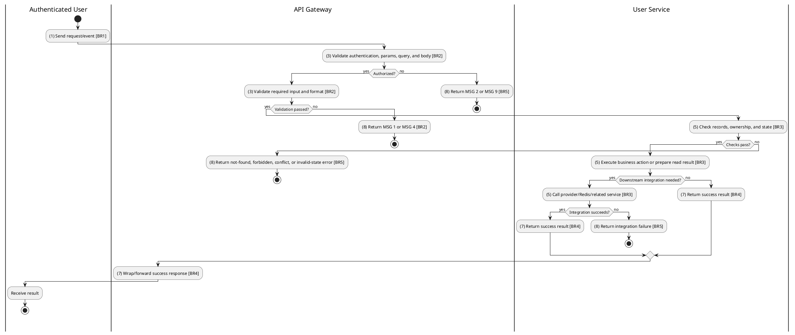
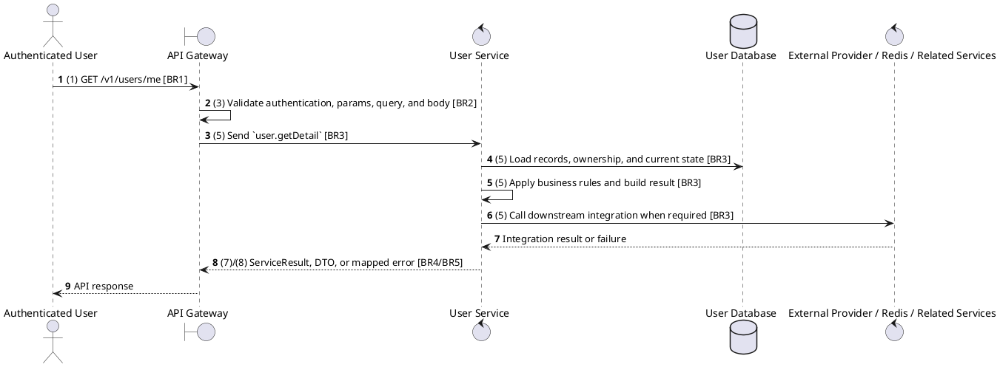

# [UM-03] Get User Profile

## Use Case Description

| Field | Details |
| :--- | :--- |
| **Name** | Get User Profile (Sync) |
| **Description** | Synchronizes user data from Clerk to the local User Service database via Webhook when a user registers or updates their profile in Clerk. |
| **Actor** | Authenticated User |
| **Trigger** | `GET /v1/users/me` |
| **Pre-condition** | Caller satisfies gateway auth/permission requirements and request data matches shared DTO/query schema. |
| **Post-condition** | Requested data is returned or the targeted state change is persisted consistently. |

## Activities Flow

## Sequence Flow

## Business Rules

| Activity | BR Code | Description |
| :--- | :--- | :--- |
| (1) | BR1 | Loading Screen Rules: ❖ The system loads the "Get User Profile (Sync)" function and receives the request/event. ❖ The system uses trigger [GET /v1/users/me]. |
| (3) | BR2 | Validate Rules: ❖ The system checks actor permission, path parameters, query values, and request body before processing. ❖ Request must pass ClerkAuthGuard and the configured Permission decorator before the gateway forwards the command. ❖ User/staff IDs and RBAC payloads must be present; DTO/Zod validation maps missing fields to MSG 1 and bad format to MSG 4 when the gateway validation layer catches them. ❖ Implemented trigger is GET /v1/users/me and service boundary uses user.getDetail; the gateway must not call stale or pluralized paths that differ from the controller. ❖ If any mandatory entries are empty, the system shows error message MSG 1. ❖ If request information is not in the correct format, the system shows error message MSG 4. |
| (5) | BR3 | Retrieval Rules: ❖ User data is sourced from Clerk-synchronized records and staff context; Clerk webhook payloads must be verified before processing. ❖ Staff managers are limited to their assigned cinema for create, view, update, and delete operations where staffContext.cinemaId is present. |
| (7) | BR4 | Message Rules: ❖ Successful read operations return the requested DTO/list using the gateway's normal response wrapper; no artificial success text is invented by the spec. |
| (8) | BR5 | Error Handling Rules: ❖ RBAC and user operations require configured Permission decorators; unknown permissions, unknown roles, and removing the last ADMIN fail with explicit RBAC errors. ❖ Gateway forwards the request to the target service through microservice pattern user.getDetail and propagates service errors through the common exception layer. ❖ If a constraint, conflict, or unexpected failure occurs, the system shows error message MSG 9. |
