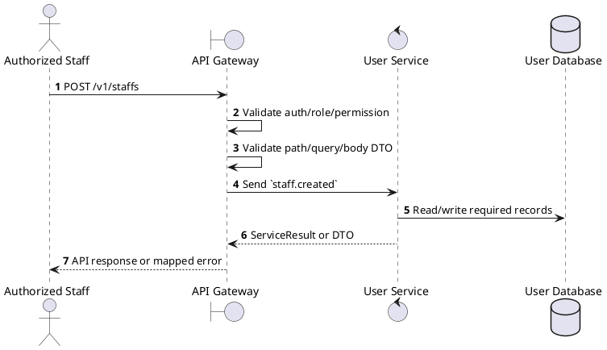
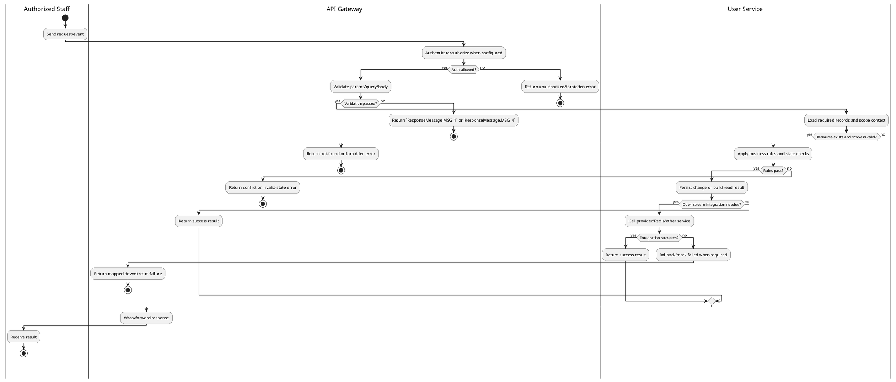

# [UM-04] Create Staff

## 1. Description

| Field | Details |
| :--- | :--- |
| **Name** | Create Staff |
| **Functional ID** | UM-04 |
| **Description** | Allows Admins or Cinema Managers to create a new staff account with a specific position and assignment. |
| **Actor** | Authorized Staff |
| **Trigger** | `POST /v1/staffs` |
| **Pre-condition** | Caller satisfies gateway auth/permission requirements and request data matches shared DTO/query schema. |
| **Post-condition** | State change is persisted atomically or the request fails without partial data inconsistency. |

## 2. Sequence Flow

## 3. Activity Flow

## 4. Business Rules

| Activity Step | Rule ID | Description |
| :--- | :--- | :--- |
| Gateway guard | BR-UM-04-01 | Request must pass ClerkAuthGuard and the configured Permission decorator before the gateway forwards the command. |
| Input validation | BR-UM-04-02 | CreateStaffSchema requires UUID `cinemaId`, fullName, email, phone, gender, DOB, position, status, workType, shiftType, non-negative salary, and hireDate. |
| Route/message boundary | BR-UM-04-03 | Implemented trigger is `POST /v1/staffs` and service boundary uses `staff.created`; the gateway must not call stale or pluralized paths that differ from the controller. |
| Business/state rule | BR-UM-04-04 | User data is sourced from Clerk-synchronized records and staff context; Clerk webhook payloads must be verified before processing. |
| Business/state rule | BR-UM-04-05 | Staff managers are limited to their assigned cinema for create, view, update, and delete operations where staffContext.cinemaId is present. |
| Business/state rule | BR-UM-04-06 | RBAC and user operations require configured Permission decorators; unknown permissions, unknown roles, and removing the last ADMIN fail with explicit RBAC errors. |
| Business/state rule | BR-UM-04-07 | Staff create/update synchronizes with Clerk where configured and returns propagated errors for duplicate identity or external sync failure. |
| Business/state rule | BR-UM-04-08 | Create actions must reject duplicate/conflicting records before persistence and return the created DTO after persistence. |
| Integration constraint | BR-UM-04-09 | Gateway forwards the request to the target service through microservice pattern `staff.created` and propagates service errors through the common exception layer. |
| Success response | BR-UM-04-10 | Successful write/validation/state-changing operations return service data with `ResponseMessage.MSG_7` where the service wraps a ServiceResult; pure reads return the requested DTO/list. |
| Failure response | BR-UM-04-11 | Expected failures include staff cinema-scope ForbiddenException messages, invalid Clerk webhook envelope, unknown permissions/roles, duplicate staff identity, and `Cannot remove the last ADMIN`. |
