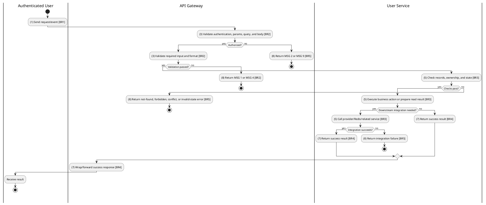
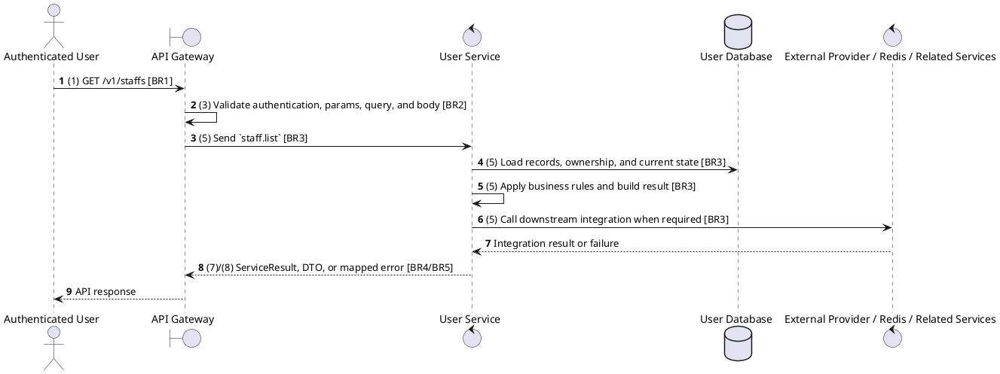

# [UM-05] List Staff

## Use Case Description

| Field | Details |
| :--- | :--- |
| **Name** | List Staff |
| **Description** | Allows Admins or Cinema Managers to view a list of staff members, with filtering options for cinema location, position, and employment status. |
| **Actor** | Authenticated User |
| **Trigger** | `GET /v1/staffs` |
| **Pre-condition** | Caller satisfies gateway auth/permission requirements and request data matches shared DTO/query schema. |
| **Post-condition** | Requested data is returned or the targeted state change is persisted consistently. |

## Activities Flow

## Sequence Flow

## Business Rules

| Activity | BR Code | Description |
| :--- | :--- | :--- |
| (1) | BR1 | Loading Screen Rules: ❖ The system loads the "List Staff" function and receives the request/event. ❖ The system uses trigger [GET /v1/staffs]. |
| (3) | BR2 | Validate Rules: ❖ The system checks the items [page], [limit], [sortBy], [sortOrder], [cinemaId], [fullName], [gender], [dob], [position], [status], [workType], [shiftType]. ❖ The system validates data according to DTO/schema StaffQuery. ❖ Optional fields: [page], [limit], [sortBy], [sortOrder], [cinemaId], [fullName], [gender], [dob], [position], [status], [workType], [shiftType]. ❖ Field constraint: [page] is optional, type number. ❖ Field constraint: [limit] is optional, type number. ❖ Field constraint: [sortBy] is optional, type string. ❖ Field constraint: [sortOrder] is optional, type SortOrder. ❖ Field constraint: [cinemaId] is optional, type string. ❖ Field constraint: [fullName] is optional, type string. ❖ Field constraint: [gender] is optional, type Gender. ❖ Field constraint: [dob] is optional, type Date. ❖ Field constraint: [position] is optional, type StaffPosition. ❖ Field constraint: [status] is optional, type StaffStatus. ❖ Field constraint: [workType] is optional, type WorkType. ❖ Field constraint: [shiftType] is optional, type ShiftType. ❖ If any type, format, enum, range, date, UUID, or email constraint is invalid, the system shows error message MSG 4. |
| (5) | BR3 | Retrieval Rules: ❖ User data is sourced from Clerk-synchronized records and staff context; Clerk webhook payloads must be verified before processing. ❖ Staff managers are limited to their assigned cinema for create, view, update, and delete operations where staffContext.cinemaId is present. ❖ List responses must honor supported filters, pagination defaults, and cinema/user scoping before returning data. |
| (7) | BR4 | Message Rules: ❖ Successful read operations return the requested DTO/list using the gateway's normal response wrapper; no artificial success text is invented by the spec. |
| (8) | BR5 | Error Handling Rules: ❖ RBAC and user operations require configured Permission decorators; unknown permissions, unknown roles, and removing the last ADMIN fail with explicit RBAC errors. ❖ Staff create/update synchronizes with Clerk where configured and returns propagated errors for duplicate identity or external sync failure. ❖ Gateway forwards the request to the target service through microservice pattern staff.list and propagates service errors through the common exception layer. ❖ Expected failures include staff cinema-scope ForbiddenException messages, invalid Clerk webhook envelope, unknown permissions/roles, duplicate staff identity, and Cannot remove the last ADMIN. ❖ If a constraint, conflict, or unexpected failure occurs, the system shows error message MSG 9. |
