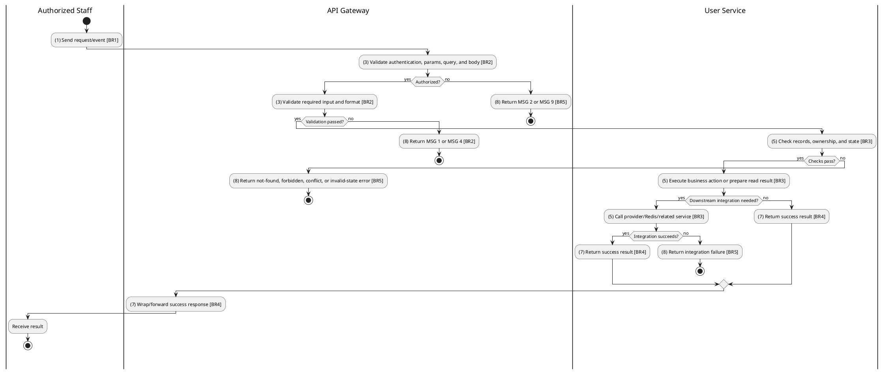
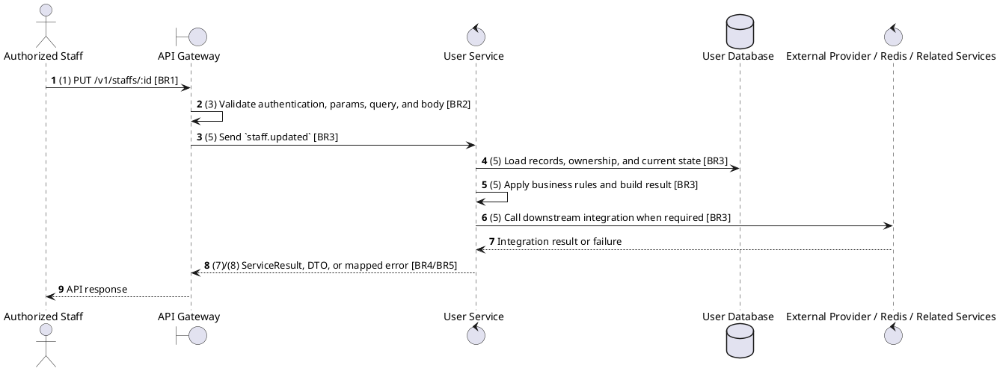

# [UM-07] Update Staff

## Use Case Description

| Field | Details |
| :--- | :--- |
| **Name** | Update Staff |
| **Description** | Updates the information of an existing staff member (e.g., position, status, assignment). |
| **Actor** | Authorized Staff |
| **Trigger** | `PUT /v1/staffs/:id` |
| **Pre-condition** | Caller satisfies gateway auth/permission requirements and request data matches shared DTO/query schema. |
| **Post-condition** | State change is persisted atomically or the request fails without partial data inconsistency. |

## Activities Flow

## Sequence Flow

## Business Rules

| Activity | BR Code | Description |
| :--- | :--- | :--- |
| (1) | BR1 | Loading Screen Rules: ❖ The system loads the "Update Staff" function and receives the request/event. ❖ The system uses trigger [PUT /v1/staffs/:id]. |
| (3) | BR2 | Validate Rules: ❖ The system checks the items [id], [cinemaId], [fullName], [email], [phone], [gender], [dob], [position], [status], [workType], [shiftType], [salary], [hireDate]. ❖ The system validates data according to DTO/schema UpdateStaffRequest. ❖ Required fields: [id]. ❖ If any required entries are empty, the system shows error message MSG 1. ❖ Optional fields: [cinemaId], [fullName], [email], [phone], [gender], [dob], [position], [status], [workType], [shiftType], [salary], [hireDate]. ❖ Field constraint: [id] is required, type string, path parameter. ❖ Field constraint: [cinemaId] is optional, type value, must be a UUID. ❖ Field constraint: [fullName] is optional, type string, minimum 1. ❖ Field constraint: [email] is optional, type string, must be an email format. ❖ Field constraint: [phone] is optional, type string, minimum 9. ❖ Field constraint: [gender] is optional, type enum, allowed values: Gender. ❖ Field constraint: [dob] is optional, type date, is coerced from request input. ❖ Field constraint: [position] is optional, type enum, allowed values: StaffPosition. ❖ Field constraint: [status] is optional, type enum, allowed values: StaffStatus. ❖ Field constraint: [workType] is optional, type enum, allowed values: WorkType. ❖ Field constraint: [shiftType] is optional, type enum, allowed values: ShiftType. ❖ Field constraint: [salary] is optional, type number, minimum 0. ❖ Field constraint: [hireDate] is optional, type date, is coerced from request input. ❖ If any type, format, enum, range, date, UUID, or email constraint is invalid, the system shows error message MSG 4. |
| (5) | BR3 | Updating Rules: ❖ User data is sourced from Clerk-synchronized records and staff context; Clerk webhook payloads must be verified before processing. ❖ Staff managers are limited to their assigned cinema for create, view, update, and delete operations where staffContext.cinemaId is present. ❖ Update actions must merge only allowed DTO fields and leave omitted fields unchanged. |
| (7) | BR4 | Message Rules: ❖ Successful write/validation/state-changing operations return service data with MSG 7 where the service wraps a ServiceResult; pure reads return the requested DTO/list. |
| (8) | BR5 | Error Handling Rules: ❖ RBAC and user operations require configured Permission decorators; unknown permissions, unknown roles, and removing the last ADMIN fail with explicit RBAC errors. ❖ Staff create/update synchronizes with Clerk where configured and returns propagated errors for duplicate identity or external sync failure. ❖ Gateway forwards the request to the target service through microservice pattern staff.updated and propagates service errors through the common exception layer. ❖ Expected failures include staff cinema-scope ForbiddenException messages, invalid Clerk webhook envelope, unknown permissions/roles, duplicate staff identity, and Cannot remove the last ADMIN. ❖ If a constraint, conflict, or unexpected failure occurs, the system shows error message MSG 9. |
