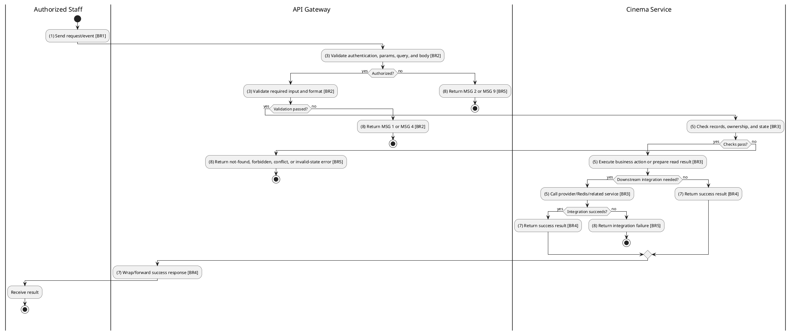
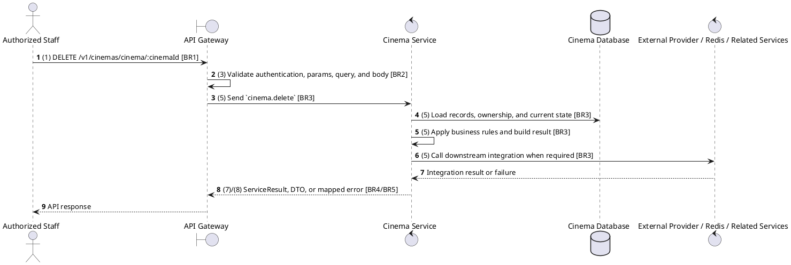

# [CM-04] Delete Cinema

## Use Case Description

| Field | Details |
| :--- | :--- |
| **Name** | Delete Cinema |
| **Description** | Soft-deletes or permanently removes a cinema from the system. |
| **Actor** | Authorized Staff |
| **Trigger** | `DELETE /v1/cinemas/cinema/:cinemaId` |
| **Pre-condition** | Caller satisfies gateway auth/permission requirements and request data matches shared DTO/query schema. |
| **Post-condition** | State change is persisted atomically or the request fails without partial data inconsistency. |

## Activities Flow

## Sequence Flow

## Business Rules

| Activity | BR Code | Description |
| :--- | :--- | :--- |
| (1) | BR1 | Loading Screen Rules: ❖ The system loads the "Delete Cinema" function and receives the request/event. ❖ The system uses trigger [DELETE /v1/cinemas/cinema/:cinemaId]. |
| (3) | BR2 | Validate Rules: ❖ The system checks the items [cinemaId]. ❖ Required fields: [cinemaId]. ❖ If any required entries are empty, the system shows error message MSG 1. ❖ Field constraint: [cinemaId] is required, type string, path parameter. ❖ If any type, format, enum, range, date, UUID, or email constraint is invalid, the system shows error message MSG 4. |
| (5) | BR3 | Deleting Rules: ❖ The system executes the main business operation and returns the requested data or persists the state change consistently. |
| (7) | BR4 | Message Rules: ❖ Successful write/validation/state-changing operations return service data with MSG 7 where the service wraps a ServiceResult; pure reads return the requested DTO/list. |
| (8) | BR5 | Error Handling Rules: ❖ Gateway forwards the request to the target service through microservice pattern cinema.delete and propagates service errors through the common exception layer. ❖ Expected failures include resource not found, explicit gateway forbidden messages for wrong cinema scope, Cannot delete cinema with dependent data, Cannot delete hall with dependent data, and Seat not found. ❖ If a constraint, conflict, or unexpected failure occurs, the system shows error message MSG 9. |
