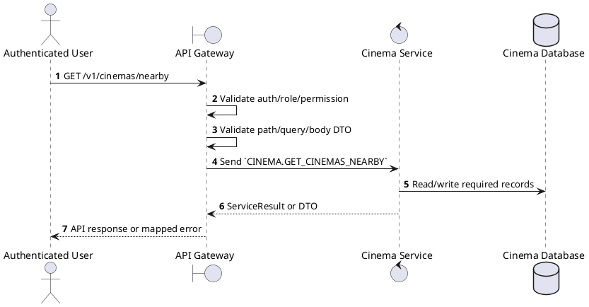
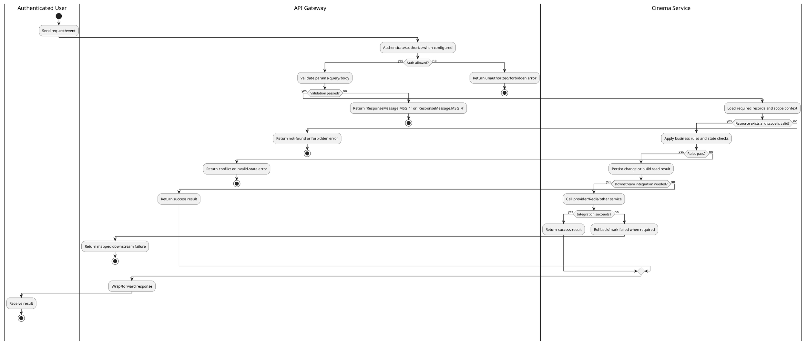

# [CM-06] Search Cinemas Nearby

## 1. Description

| Field | Details |
| :--- | :--- |
| **Name** | Search Cinemas Nearby |
| **Functional ID** | CM-06 |
| **Description** | Finds cinemas located within a certain radius of the user's provided coordinates (latitude/longitude). |
| **Actor** | Authenticated User |
| **Trigger** | `GET /v1/cinemas/nearby` |
| **Pre-condition** | Caller satisfies gateway auth/permission requirements and request data matches shared DTO/query schema. |
| **Post-condition** | Requested data is returned or the targeted state change is persisted consistently. |

## 2. Sequence Flow

## 3. Activity Flow

## 4. Business Rules

| Activity Step | Rule ID | Description |
| :--- | :--- | :--- |
| Gateway guard | BR-CM-06-01 | Request must pass ClerkAuthGuard and the configured Permission decorator before the gateway forwards the command. |
| Input validation | BR-CM-06-02 | Location queries parse `lat`, `lon`, `radius`, `page`, `limit`, and sorting values; invalid numeric values fail request validation. |
| Route/message boundary | BR-CM-06-03 | Implemented trigger is `GET /v1/cinemas/nearby` and service boundary uses `CINEMA.GET_CINEMAS_NEARBY`; the gateway must not call stale or pluralized paths that differ from the controller. |
| Business/state rule | BR-CM-06-04 | Cinema-scoped staff can only mutate resources in their own cinema; global create/delete operations reject cinema managers where the gateway checks staff context. |
| Business/state rule | BR-CM-06-05 | Deletes must fail when dependent halls, seats, showtimes, or reservations would violate service constraints. |
| Business/state rule | BR-CM-06-06 | Status filters use the relevant enum and default active status when controller code applies a default. |
| Business/state rule | BR-CM-06-07 | Cinema/Hall/Ticket pricing responses are returned from Cinema Service without exposing internal persistence-only fields. |
| Integration constraint | BR-CM-06-08 | Gateway forwards the request to the target service through microservice pattern `CINEMA.GET_CINEMAS_NEARBY` and propagates service errors through the common exception layer. |
| Success response | BR-CM-06-09 | Successful read operations return the requested DTO/list using the gateway's normal response wrapper; no artificial success text is invented by the spec. |
| Failure response | BR-CM-06-10 | Expected failures include resource not found, explicit gateway forbidden messages for wrong cinema scope, `Cannot delete cinema with dependent data`, `Cannot delete hall with dependent data`, and `Seat not found`. |
