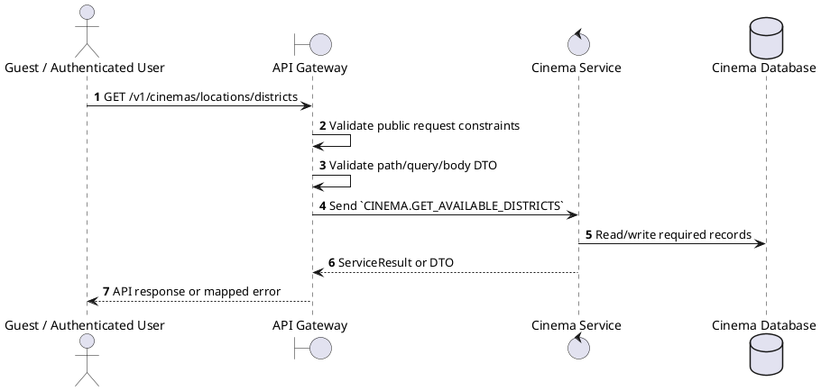
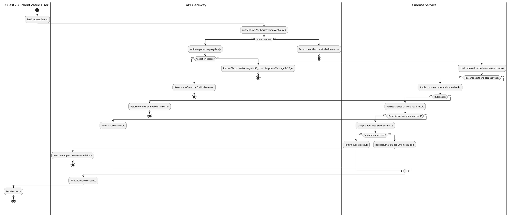

# [CM-10] Get Available Districts

## 1. Description

| Field | Details |
| :--- | :--- |
| **Name** | Get Available Districts |
| **Functional ID** | CM-10 |
| **Description** | Returns a list of districts for a specific city where cinemas are located. |
| **Actor** | Guest / Authenticated User |
| **Trigger** | `GET /v1/cinemas/locations/districts` |
| **Pre-condition** | Required path/query parameters are provided; no customer session is required for this read. |
| **Post-condition** | Requested data is returned or the targeted state change is persisted consistently. |

## 2. Sequence Flow

## 3. Activity Flow

## 4. Business Rules

| Activity Step | Rule ID | Description |
| :--- | :--- | :--- |
| Gateway guard | BR-CM-10-01 | Read operation is public unless the gateway method explicitly applies ClerkAuthGuard; staff cinema context may still restrict scoped results when present. |
| Input validation | BR-CM-10-02 | Required search/filter query values such as `query` or `city` must be non-empty; missing values throw the explicit gateway BadRequest message. |
| Route/message boundary | BR-CM-10-03 | Implemented trigger is `GET /v1/cinemas/locations/districts` and service boundary uses `CINEMA.GET_AVAILABLE_DISTRICTS`; the gateway must not call stale or pluralized paths that differ from the controller. |
| Business/state rule | BR-CM-10-04 | Cinema-scoped staff can only mutate resources in their own cinema; global create/delete operations reject cinema managers where the gateway checks staff context. |
| Business/state rule | BR-CM-10-05 | Deletes must fail when dependent halls, seats, showtimes, or reservations would violate service constraints. |
| Business/state rule | BR-CM-10-06 | Status filters use the relevant enum and default active status when controller code applies a default. |
| Business/state rule | BR-CM-10-07 | Cinema/Hall/Ticket pricing responses are returned from Cinema Service without exposing internal persistence-only fields. |
| Integration constraint | BR-CM-10-08 | Gateway forwards the request to the target service through microservice pattern `CINEMA.GET_AVAILABLE_DISTRICTS` and propagates service errors through the common exception layer. |
| Success response | BR-CM-10-09 | Successful read operations return the requested DTO/list using the gateway's normal response wrapper; no artificial success text is invented by the spec. |
| Failure response | BR-CM-10-10 | Expected failures include resource not found, explicit gateway forbidden messages for wrong cinema scope, `Cannot delete cinema with dependent data`, `Cannot delete hall with dependent data`, and `Seat not found`. |
