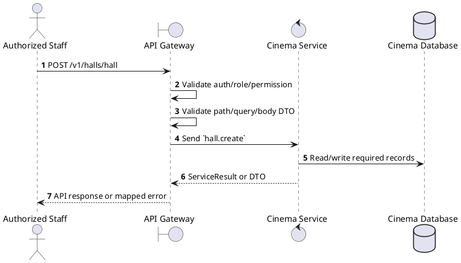
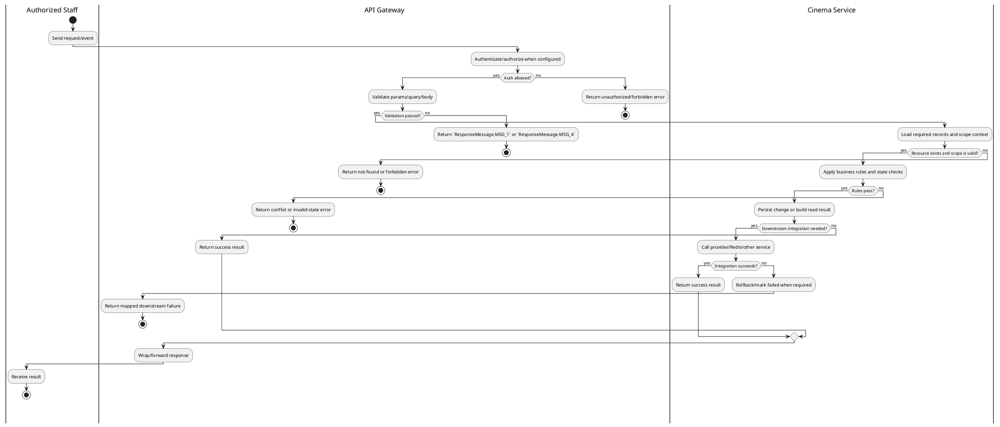

# [HM-03] Create Hall

## 1. Description

| Field | Details |
| :--- | :--- |
| **Name** | Create Hall |
| **Functional ID** | HM-03 |
| **Description** | Creates a new hall within a cinema, defining its name, type, and total seat capacity. Note: Seat layout is usually generated separately or initialized here. |
| **Actor** | Authorized Staff |
| **Trigger** | `POST /v1/halls/hall` |
| **Pre-condition** | Caller satisfies gateway auth/permission requirements and request data matches shared DTO/query schema. |
| **Post-condition** | State change is persisted atomically or the request fails without partial data inconsistency. |

## 2. Sequence Flow

## 3. Activity Flow

## 4. Business Rules

| Activity Step | Rule ID | Description |
| :--- | :--- | :--- |
| Gateway guard | BR-HM-03-01 | Request must pass ClerkAuthGuard and the configured Permission decorator before the gateway forwards the command. |
| Input validation | BR-HM-03-02 | CreateHallSchema requires `cinemaId`, `name`, and `type`; type must be HallTypeEnum and layout defaults to `STANDARD` if omitted. |
| Route/message boundary | BR-HM-03-03 | Implemented trigger is `POST /v1/halls/hall` and service boundary uses `hall.create`; the gateway must not call stale or pluralized paths that differ from the controller. |
| Business/state rule | BR-HM-03-04 | Cinema-scoped staff can only mutate resources in their own cinema; global create/delete operations reject cinema managers where the gateway checks staff context. |
| Business/state rule | BR-HM-03-05 | Deletes must fail when dependent halls, seats, showtimes, or reservations would violate service constraints. |
| Business/state rule | BR-HM-03-06 | Status filters use the relevant enum and default active status when controller code applies a default. |
| Business/state rule | BR-HM-03-07 | Cinema/Hall/Ticket pricing responses are returned from Cinema Service without exposing internal persistence-only fields. |
| Business/state rule | BR-HM-03-08 | Create actions must reject duplicate/conflicting records before persistence and return the created DTO after persistence. |
| Integration constraint | BR-HM-03-09 | Gateway forwards the request to the target service through microservice pattern `hall.create` and propagates service errors through the common exception layer. |
| Success response | BR-HM-03-10 | Successful write/validation/state-changing operations return service data with `ResponseMessage.MSG_7` where the service wraps a ServiceResult; pure reads return the requested DTO/list. |
| Failure response | BR-HM-03-11 | Expected failures include resource not found, explicit gateway forbidden messages for wrong cinema scope, `Cannot delete cinema with dependent data`, `Cannot delete hall with dependent data`, and `Seat not found`. |
