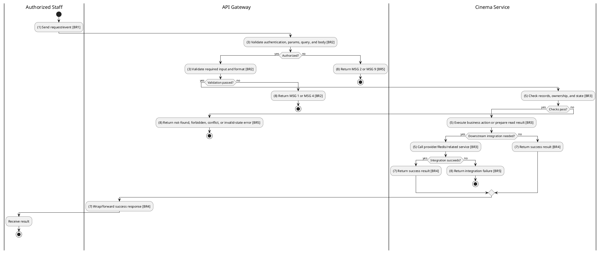
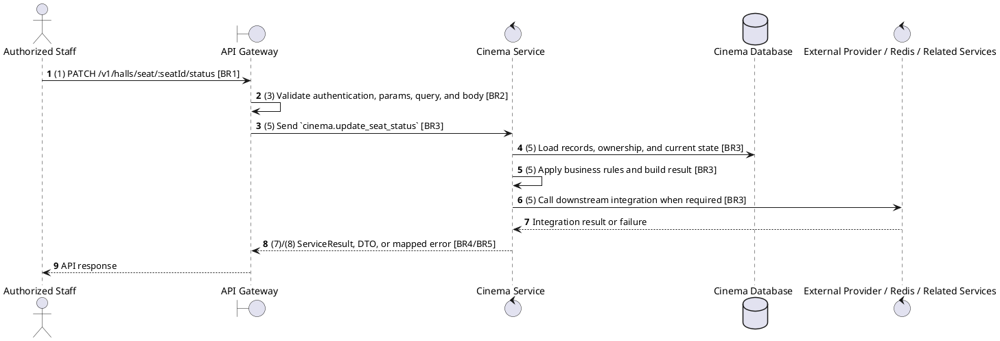

# [HM-06] Update Seat Status

## Use Case Description

| Field | Details |
| :--- | :--- |
| **Name** | Update Seat Status |
| **Description** | Allows modifying the status of a specific seat (e.g., mark as BROKEN or MAINTENANCE) to prevent booking. |
| **Actor** | Authorized Staff |
| **Trigger** | `PATCH /v1/halls/seat/:seatId/status` |
| **Pre-condition** | Caller satisfies gateway auth/permission requirements and request data matches shared DTO/query schema. |
| **Post-condition** | State change is persisted atomically or the request fails without partial data inconsistency. |

## Activities Flow

## Sequence Flow

## Business Rules

| Activity | BR Code | Description |
| :--- | :--- | :--- |
| (1) | BR1 | Loading Screen Rules: ❖ The system loads the "Update Seat Status" function and receives the request/event. ❖ The system uses trigger [PATCH /v1/halls/seat/:seatId/status]. |
| (3) | BR2 | Validate Rules: ❖ The system checks the items [seatId], [status]. ❖ The system validates data according to DTO/schema UpdateSeatStatusRequest. ❖ Required fields: [seatId]. ❖ If any required entries are empty, the system shows error message MSG 1. ❖ Optional fields: [status]. ❖ Default values: [status] = SeatStatusEnum.ACTIVE. ❖ Field constraint: [seatId] is required, type string, path parameter. ❖ Field constraint: [status] is optional, type value, default SeatStatusEnum.ACTIVE, allowed values: SeatStatusEnum. ❖ If any type, format, enum, range, date, UUID, or email constraint is invalid, the system shows error message MSG 4. |
| (5) | BR3 | Updating Rules: ❖ The system executes the main business operation and returns the requested data or persists the state change consistently. ❖ Update actions must merge only allowed DTO fields and leave omitted fields unchanged. |
| (7) | BR4 | Message Rules: ❖ Successful write/validation/state-changing operations return service data with MSG 7 where the service wraps a ServiceResult; pure reads return the requested DTO/list. |
| (8) | BR5 | Error Handling Rules: ❖ Gateway forwards the request to the target service through microservice pattern cinema.update_seat_status and propagates service errors through the common exception layer. ❖ If a constraint, conflict, or unexpected failure occurs, the system shows error message MSG 9. |
