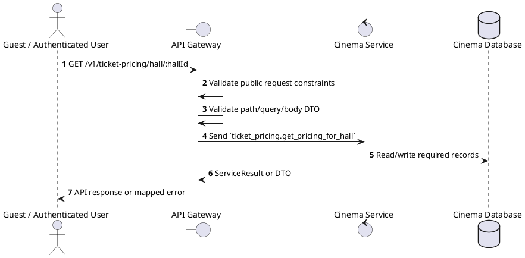
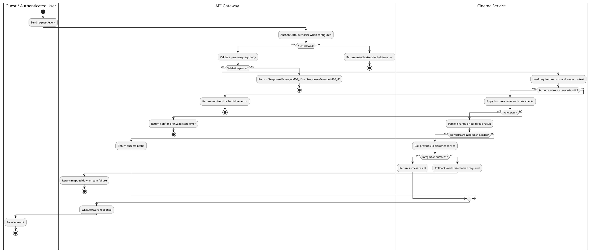

# [TP-01] Get Pricing for Hall

## 1. Description

| Field | Details |
| :--- | :--- |
| **Name** | Get Pricing for Hall |
| **Functional ID** | TP-01 |
| **Description** | Retrieves the ticket pricing configuration for a specific hall, which includes pricing by seat type (Standard, VIP, etc.) and day type (Weekday, Weekend, Holiday). |
| **Actor** | Guest / Authenticated User |
| **Trigger** | `GET /v1/ticket-pricing/hall/:hallId` |
| **Pre-condition** | Required path/query parameters are provided; no customer session is required for this read. |
| **Post-condition** | Requested data is returned or the targeted state change is persisted consistently. |

## 2. Sequence Flow

## 3. Activity Flow

## 4. Business Rules

| Activity Step | Rule ID | Description |
| :--- | :--- | :--- |
| Gateway guard | BR-TP-01-01 | Endpoint is callable without a customer session; any staff context added by the gateway can narrow the returned data. |
| Input validation | BR-TP-01-02 | Ticket pricing update values must match UpdateTicketPricingSchema; hall/pricing IDs are required and price fields must be numeric. |
| Route/message boundary | BR-TP-01-03 | Implemented trigger is `GET /v1/ticket-pricing/hall/:hallId` and service boundary uses `ticket_pricing.get_pricing_for_hall`; the gateway must not call stale or pluralized paths that differ from the controller. |
| Business/state rule | BR-TP-01-04 | Cinema-scoped staff can only mutate resources in their own cinema; global create/delete operations reject cinema managers where the gateway checks staff context. |
| Business/state rule | BR-TP-01-05 | Deletes must fail when dependent halls, seats, showtimes, or reservations would violate service constraints. |
| Business/state rule | BR-TP-01-06 | Status filters use the relevant enum and default active status when controller code applies a default. |
| Business/state rule | BR-TP-01-07 | Cinema/Hall/Ticket pricing responses are returned from Cinema Service without exposing internal persistence-only fields. |
| Integration constraint | BR-TP-01-08 | Gateway forwards the request to the target service through microservice pattern `ticket_pricing.get_pricing_for_hall` and propagates service errors through the common exception layer. |
| Success response | BR-TP-01-09 | Successful read operations return the requested DTO/list using the gateway's normal response wrapper; no artificial success text is invented by the spec. |
| Failure response | BR-TP-01-10 | Expected failures include validation errors, auth/permission denial, not found, conflict, and downstream service/database failures. |
