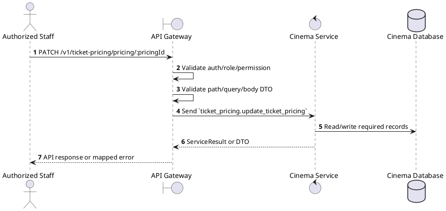
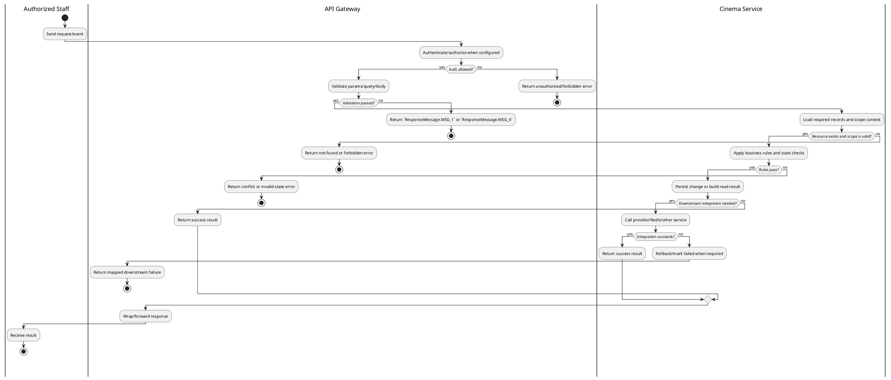

# [TP-02] Update Ticket Pricing

## 1. Description

| Field | Details |
| :--- | :--- |
| **Name** | Update Ticket Pricing |
| **Functional ID** | TP-02 |
| **Description** | Allows an Admin to update the price for a specific pricing rule (e.g., change the price of a VIP seat on Weekends). |
| **Actor** | Authorized Staff |
| **Trigger** | `PATCH /v1/ticket-pricing/pricing/:pricingId` |
| **Pre-condition** | Caller satisfies gateway auth/permission requirements and request data matches shared DTO/query schema. |
| **Post-condition** | State change is persisted atomically or the request fails without partial data inconsistency. |

## 2. Sequence Flow

## 3. Activity Flow

## 4. Business Rules

| Activity Step | Rule ID | Description |
| :--- | :--- | :--- |
| Gateway guard | BR-TP-02-01 | Request must pass ClerkAuthGuard and the configured Permission decorator before the gateway forwards the command. |
| Input validation | BR-TP-02-02 | Ticket pricing update values must match UpdateTicketPricingSchema; hall/pricing IDs are required and price fields must be numeric. |
| Route/message boundary | BR-TP-02-03 | Implemented trigger is `PATCH /v1/ticket-pricing/pricing/:pricingId` and service boundary uses `ticket_pricing.update_ticket_pricing`; the gateway must not call stale or pluralized paths that differ from the controller. |
| Business/state rule | BR-TP-02-04 | Cinema-scoped staff can only mutate resources in their own cinema; global create/delete operations reject cinema managers where the gateway checks staff context. |
| Business/state rule | BR-TP-02-05 | Deletes must fail when dependent halls, seats, showtimes, or reservations would violate service constraints. |
| Business/state rule | BR-TP-02-06 | Status filters use the relevant enum and default active status when controller code applies a default. |
| Business/state rule | BR-TP-02-07 | Cinema/Hall/Ticket pricing responses are returned from Cinema Service without exposing internal persistence-only fields. |
| Business/state rule | BR-TP-02-08 | Update actions must merge only allowed DTO fields and leave omitted fields unchanged. |
| Integration constraint | BR-TP-02-09 | Gateway forwards the request to the target service through microservice pattern `ticket_pricing.update_ticket_pricing` and propagates service errors through the common exception layer. |
| Success response | BR-TP-02-10 | Successful write/validation/state-changing operations return service data with `ResponseMessage.MSG_7` where the service wraps a ServiceResult; pure reads return the requested DTO/list. |
| Failure response | BR-TP-02-11 | Expected failures include validation errors, auth/permission denial, not found, conflict, and downstream service/database failures. |
