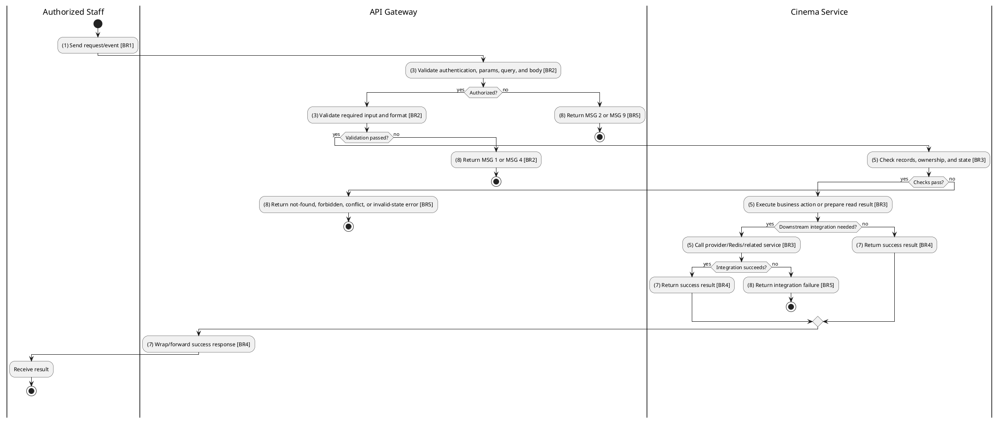
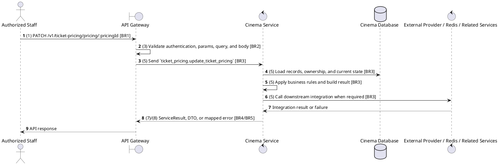

# [TP-02] Update Ticket Pricing

## Use Case Description

| Field | Details |
| :--- | :--- |
| **Name** | Update Ticket Pricing |
| **Description** | Allows an Admin to update the price for a specific pricing rule (e.g., change the price of a VIP seat on Weekends). |
| **Actor** | Authorized Staff |
| **Trigger** | `PATCH /v1/ticket-pricing/pricing/:pricingId` |
| **Pre-condition** | Caller satisfies gateway auth/permission requirements and request data matches shared DTO/query schema. |
| **Post-condition** | State change is persisted atomically or the request fails without partial data inconsistency. |

## Activities Flow

## Sequence Flow

## Business Rules

| Activity | BR Code | Description |
| :--- | :--- | :--- |
| (1) | BR1 | Loading Screen Rules: ❖ The system loads the "Update Ticket Pricing" function and receives the request/event. ❖ The system uses trigger [PATCH /v1/ticket-pricing/pricing/:pricingId]. |
| (3) | BR2 | Validate Rules: ❖ The system checks actor permission, path parameters, query values, and request body before processing. ❖ Request must pass ClerkAuthGuard and the configured Permission decorator before the gateway forwards the command. ❖ Ticket pricing update values must match UpdateTicketPricingSchema; hall/pricing IDs are required and price fields must be numeric. ❖ Implemented trigger is PATCH /v1/ticket-pricing/pricing/:pricingId and service boundary uses ticket_pricing.update_ticket_pricing; the gateway must not call stale or pluralized paths that differ from the controller. ❖ Cinema-scoped staff can only mutate resources in their own cinema; global create/delete operations reject cinema managers where the gateway checks staff context. ❖ If any mandatory entries are empty, the system shows error message MSG 1. ❖ If request information is not in the correct format, the system shows error message MSG 4. |
| (5) | BR3 | Updating Rules: ❖ The system executes the main business operation and returns the requested data or persists the state change consistently. ❖ Update actions must merge only allowed DTO fields and leave omitted fields unchanged. |
| (7) | BR4 | Message Rules: ❖ Successful write/validation/state-changing operations return service data with MSG 7 where the service wraps a ServiceResult; pure reads return the requested DTO/list. |
| (8) | BR5 | Error Handling Rules: ❖ Gateway forwards the request to the target service through microservice pattern ticket_pricing.update_ticket_pricing and propagates service errors through the common exception layer. ❖ Expected failures include validation errors, auth/permission denial, not found, conflict, and downstream service/database failures. ❖ If a constraint, conflict, or unexpected failure occurs, the system shows error message MSG 9. |
