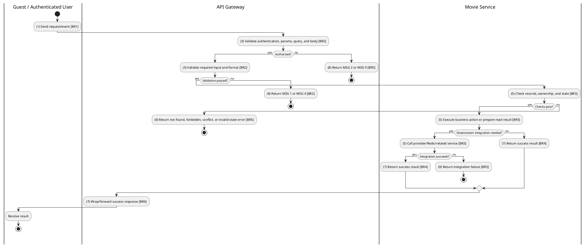
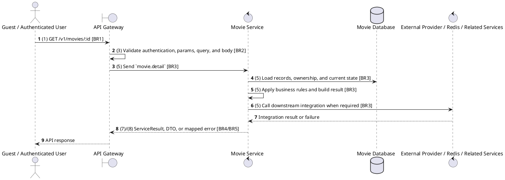

# [MV-02] Get Movie Details

## Use Case Description

| Field | Details |
| :--- | :--- |
| **Name** | Get Movie Details |
| **Description** | Retrieves comprehensive information about a specific movie, including its overview, cast, crew, and genres. |
| **Actor** | Guest / Authenticated User |
| **Trigger** | `GET /v1/movies/:id` |
| **Pre-condition** | Required path/query parameters are provided; no customer session is required for this read. |
| **Post-condition** | Requested data is returned or the targeted state change is persisted consistently. |

## Activities Flow

## Sequence Flow

## Business Rules

| Activity | BR Code | Description |
| :--- | :--- | :--- |
| (1) | BR1 | Loading Screen Rules: ❖ The system loads the "Get Movie Details" function and receives the request/event. ❖ The system uses trigger [GET /v1/movies/:id]. |
| (3) | BR2 | Validate Rules: ❖ The system checks the items [id]. ❖ Required fields: [id]. ❖ If any required entries are empty, the system shows error message MSG 1. ❖ Field constraint: [id] is required, type string, path parameter. ❖ If any type, format, enum, range, date, UUID, or email constraint is invalid, the system shows error message MSG 4. |
| (5) | BR3 | Retrieval Rules: ❖ The system executes the main business operation and returns the requested data or persists the state change consistently. |
| (7) | BR4 | Message Rules: ❖ Successful read operations return the requested DTO/list using the gateway's normal response wrapper; no artificial success text is invented by the spec. |
| (8) | BR5 | Error Handling Rules: ❖ Referenced movies, releases, genres, and reviews must exist before update/delete/detail actions; not found paths use ResourceNotFoundException or service errors. ❖ Gateway forwards the request to the target service through microservice pattern movie.detail and propagates service errors through the common exception layer. ❖ Expected failures include ResourceNotFoundException for missing movie/genre/release/review, validation failures from strict Zod DTOs, and database constraint errors. ❖ If a constraint, conflict, or unexpected failure occurs, the system shows error message MSG 9. |
