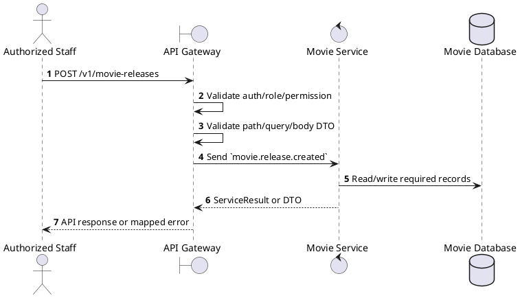
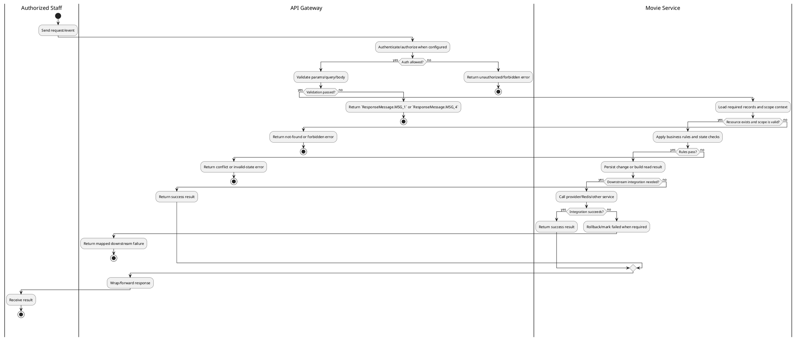

# [MR-01] Create Movie Release

## 1. Description

| Field | Details |
| :--- | :--- |
| **Name** | Create Movie Release |
| **Functional ID** | MR-01 |
| **Description** | Creates a new release entry for a movie, specifying the release date, end date, and format (e.g., 2D, 3D, IMAX). |
| **Actor** | Authorized Staff |
| **Trigger** | `POST /v1/movie-releases` |
| **Pre-condition** | Caller satisfies gateway auth/permission requirements and request data matches shared DTO/query schema. |
| **Post-condition** | State change is persisted atomically or the request fails without partial data inconsistency. |

## 2. Sequence Flow

## 3. Activity Flow

## 4. Business Rules

| Activity Step | Rule ID | Description |
| :--- | :--- | :--- |
| Gateway guard | BR-MR-01-01 | Request must pass ClerkAuthGuard and the configured Permission decorator before the gateway forwards the command. |
| Input validation | BR-MR-01-02 | Movie release create requires UUID `movieId` and `startDate`; `endDate` and `note` are optional, and note is limited to 500 characters. |
| Route/message boundary | BR-MR-01-03 | Implemented trigger is `POST /v1/movie-releases` and service boundary uses `movie.release.created`; the gateway must not call stale or pluralized paths that differ from the controller. |
| Business/state rule | BR-MR-01-04 | Movie catalog writes require authenticated staff/global permission; public reads only expose catalog/review data intended for clients. |
| Business/state rule | BR-MR-01-05 | Referenced movies, releases, genres, and reviews must exist before update/delete/detail actions; not found paths use ResourceNotFoundException or service errors. |
| Business/state rule | BR-MR-01-06 | Movie release dates, runtime, age rating, language options, and genre references must remain consistent with shared enum/DTO contracts. |
| Business/state rule | BR-MR-01-07 | Review creation/update keeps rating in the allowed range and associates the review with the authenticated/user payload and target movie. |
| Business/state rule | BR-MR-01-08 | Create actions must reject duplicate/conflicting records before persistence and return the created DTO after persistence. |
| Integration constraint | BR-MR-01-09 | Gateway forwards the request to the target service through microservice pattern `movie.release.created` and propagates service errors through the common exception layer. |
| Success response | BR-MR-01-10 | Successful write/validation/state-changing operations return service data with `ResponseMessage.MSG_7` where the service wraps a ServiceResult; pure reads return the requested DTO/list. |
| Failure response | BR-MR-01-11 | Expected failures include ResourceNotFoundException for missing movie/genre/release/review, validation failures from strict Zod DTOs, and database constraint errors. |
