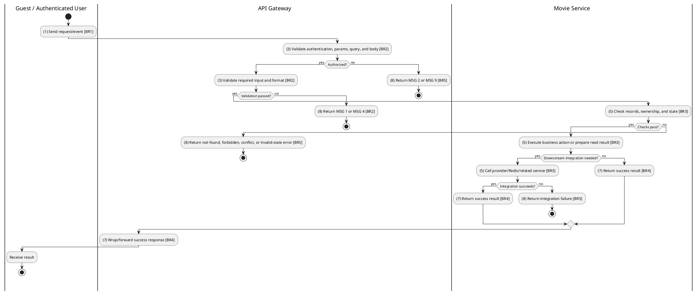
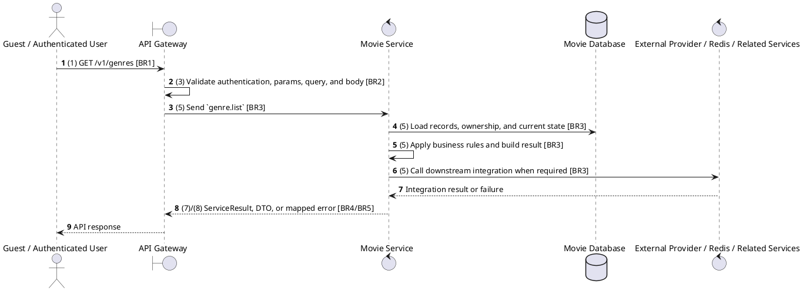

# [GM-01] List All Genres

## Use Case Description

| Field | Details |
| :--- | :--- |
| **Name** | List All Genres |
| **Description** | Retrieves a list of all movie genres available in the system. |
| **Actor** | Guest / Authenticated User |
| **Trigger** | `GET /v1/genres` |
| **Pre-condition** | Required path/query parameters are provided; no customer session is required for this read. |
| **Post-condition** | Requested data is returned or the targeted state change is persisted consistently. |

## Activities Flow

## Sequence Flow

## Business Rules

| Activity | BR Code | Description |
| :--- | :--- | :--- |
| (1) | BR1 | Loading Screen Rules: ❖ The system loads the "List All Genres" function and receives the request/event. ❖ The system uses trigger [GET /v1/genres]. |
| (3) | BR2 | Validate Rules: ❖ The system checks actor permission, path parameters, query values, and request body before processing. ❖ Read operation is public unless the gateway method explicitly applies ClerkAuthGuard; staff cinema context may still restrict scoped results when present. ❖ Implemented trigger is GET /v1/genres and service boundary uses genre.list; the gateway must not call stale or pluralized paths that differ from the controller. ❖ Movie catalog writes require authenticated staff/global permission; public reads only expose catalog/review data intended for clients. ❖ Movie release dates, runtime, age rating, language options, and genre references must remain consistent with shared enum/DTO contracts. ❖ Review creation/update keeps rating in the allowed range and associates the review with the authenticated/user payload and target movie. ❖ If any mandatory entries are empty, the system shows error message MSG 1. ❖ If request information is not in the correct format, the system shows error message MSG 4. |
| (5) | BR3 | Retrieval Rules: ❖ Genre create/update requires non-empty name; payload is strict and unknown fields are not part of the contract. ❖ List responses must honor supported filters, pagination defaults, and cinema/user scoping before returning data. |
| (7) | BR4 | Message Rules: ❖ Successful read operations return the requested DTO/list using the gateway's normal response wrapper; no artificial success text is invented by the spec. |
| (8) | BR5 | Error Handling Rules: ❖ Referenced movies, releases, genres, and reviews must exist before update/delete/detail actions; not found paths use ResourceNotFoundException or service errors. ❖ Gateway forwards the request to the target service through microservice pattern genre.list and propagates service errors through the common exception layer. ❖ Expected failures include ResourceNotFoundException for missing movie/genre/release/review, validation failures from strict Zod DTOs, and database constraint errors. ❖ If a constraint, conflict, or unexpected failure occurs, the system shows error message MSG 9. |
