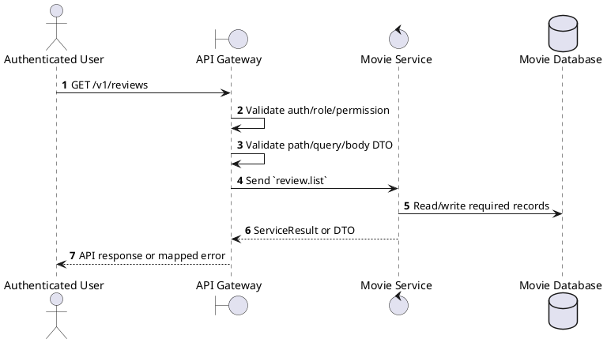
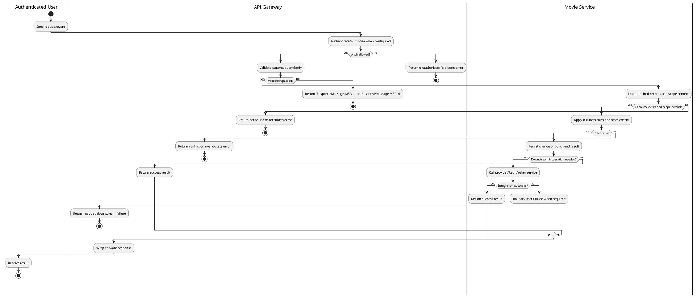

# [RV-01] List Reviews

## 1. Description

| Field | Details |
| :--- | :--- |
| **Name** | List Reviews |
| **Functional ID** | RV-01 |
| **Description** | Retrieves a list of all reviews in the system, supporting administrative oversight. |
| **Actor** | Authenticated User |
| **Trigger** | `GET /v1/reviews` |
| **Pre-condition** | Caller satisfies gateway auth/permission requirements and request data matches shared DTO/query schema. |
| **Post-condition** | Requested data is returned or the targeted state change is persisted consistently. |

## 2. Sequence Flow

## 3. Activity Flow

## 4. Business Rules

| Activity Step | Rule ID | Description |
| :--- | :--- | :--- |
| Gateway guard | BR-RV-01-01 | Request must pass ClerkAuthGuard and the configured Permission decorator before the gateway forwards the command. |
| Input validation | BR-RV-01-02 | Review create requires UUID `movieId`, `userId`, integer `rating` from 1 to 5, and `content`; update follows the review update DTO. |
| Route/message boundary | BR-RV-01-03 | Implemented trigger is `GET /v1/reviews` and service boundary uses `review.list`; the gateway must not call stale or pluralized paths that differ from the controller. |
| Business/state rule | BR-RV-01-04 | Movie catalog writes require authenticated staff/global permission; public reads only expose catalog/review data intended for clients. |
| Business/state rule | BR-RV-01-05 | Referenced movies, releases, genres, and reviews must exist before update/delete/detail actions; not found paths use ResourceNotFoundException or service errors. |
| Business/state rule | BR-RV-01-06 | Movie release dates, runtime, age rating, language options, and genre references must remain consistent with shared enum/DTO contracts. |
| Business/state rule | BR-RV-01-07 | Review creation/update keeps rating in the allowed range and associates the review with the authenticated/user payload and target movie. |
| Business/state rule | BR-RV-01-08 | List responses must honor supported filters, pagination defaults, and cinema/user scoping before returning data. |
| Integration constraint | BR-RV-01-09 | Gateway forwards the request to the target service through microservice pattern `review.list` and propagates service errors through the common exception layer. |
| Success response | BR-RV-01-10 | Successful read operations return the requested DTO/list using the gateway's normal response wrapper; no artificial success text is invented by the spec. |
| Failure response | BR-RV-01-11 | Expected failures include ResourceNotFoundException for missing movie/genre/release/review, validation failures from strict Zod DTOs, and database constraint errors. |
