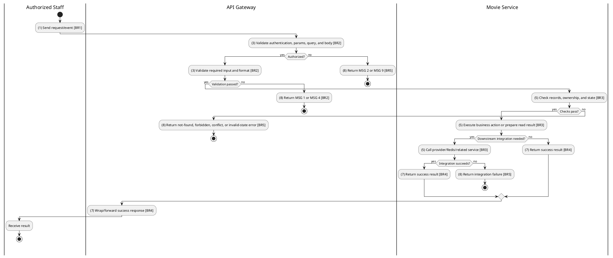
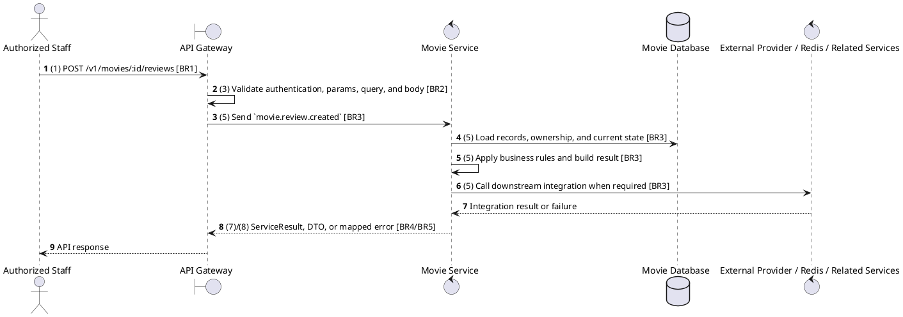

# [RV-03] Create Review

## Use Case Description

| Field | Details |
| :--- | :--- |
| **Name** | Create Review |
| **Description** | Allows a Member to submit a review and rating for a movie they have (presumably) seen. |
| **Actor** | Authorized Staff |
| **Trigger** | `POST /v1/movies/:id/reviews` |
| **Pre-condition** | Caller satisfies gateway auth/permission requirements and request data matches shared DTO/query schema. |
| **Post-condition** | State change is persisted atomically or the request fails without partial data inconsistency. |

## Activities Flow

## Sequence Flow

## Business Rules

| Activity | BR Code | Description |
| :--- | :--- | :--- |
| (1) | BR1 | Loading Screen Rules: ❖ The system loads the "Create Review" function and receives the request/event. ❖ The system uses trigger [POST /v1/movies/:id/reviews]. |
| (3) | BR2 | Validate Rules: ❖ The system checks the items [id], [movieId], [userId], [rating], [content]. ❖ The system validates data according to DTO/schema CreateReviewRequest. ❖ Required fields: [id], [movieId], [userId], [rating], [content]. ❖ If any required entries are empty, the system shows error message MSG 1. ❖ Field constraint: [id] is required, type string, path parameter. ❖ Field constraint: [movieId] is required, type value, must be a UUID. ❖ Field constraint: [userId] is required, type string. ❖ Field constraint: [rating] is required, type value, minimum 1; maximum 5; must be an integer. ❖ Field constraint: [content] is required, type string. ❖ If any type, format, enum, range, date, UUID, or email constraint is invalid, the system shows error message MSG 4. |
| (5) | BR3 | Creating Rules: ❖ The system executes the main business operation and returns the requested data or persists the state change consistently. ❖ Create actions must reject duplicate/conflicting records before persistence and return the created DTO after persistence. |
| (7) | BR4 | Message Rules: ❖ Successful write/validation/state-changing operations return service data with MSG 7 where the service wraps a ServiceResult; pure reads return the requested DTO/list. |
| (8) | BR5 | Error Handling Rules: ❖ Referenced movies, releases, genres, and reviews must exist before update/delete/detail actions; not found paths use ResourceNotFoundException or service errors. ❖ Gateway forwards the request to the target service through microservice pattern movie.review.created and propagates service errors through the common exception layer. ❖ Expected failures include ResourceNotFoundException for missing movie/genre/release/review, validation failures from strict Zod DTOs, and database constraint errors. ❖ If a constraint, conflict, or unexpected failure occurs, the system shows error message MSG 9. |
