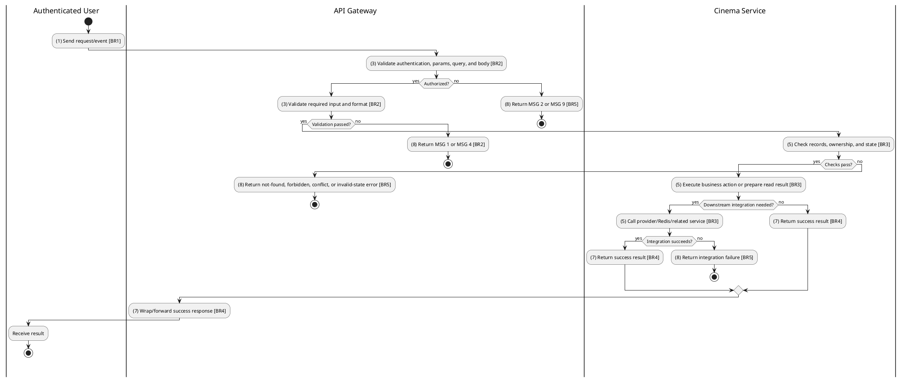
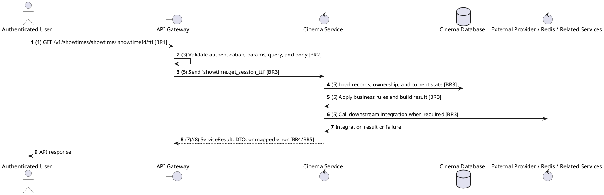

# [ST-02] Get Session TTL

## Use Case Description

| Field | Details |
| :--- | :--- |
| **Name** | Get Session TTL |
| **Description** | Retrieves the remaining time (Time To Live) for the user's current seat-holding session for a showtime. |
| **Actor** | Authenticated User |
| **Trigger** | `GET /v1/showtimes/showtime/:showtimeId/ttl` |
| **Pre-condition** | Caller satisfies gateway auth/permission requirements and request data matches shared DTO/query schema. |
| **Post-condition** | Requested data is returned or the targeted state change is persisted consistently. |

## Activities Flow

## Sequence Flow

## Business Rules

| Activity | BR Code | Description |
| :--- | :--- | :--- |
| (1) | BR1 | Loading Screen Rules: ❖ The system loads the "Get Session TTL" function and receives the request/event. ❖ The system uses trigger [GET /v1/showtimes/showtime/:showtimeId/ttl]. |
| (3) | BR2 | Validate Rules: ❖ The system checks the items [showtimeId]. ❖ Required fields: [showtimeId]. ❖ If any required entries are empty, the system shows error message MSG 1. ❖ Field constraint: [showtimeId] is required, type string, path parameter. ❖ If any type, format, enum, range, date, UUID, or email constraint is invalid, the system shows error message MSG 4. |
| (5) | BR3 | Retrieval Rules: ❖ Showtime IDs and filter dates must be parseable; enum fields use FormatEnum and ShowtimeStatusEnum and pagination values are numeric where accepted. ❖ Deleting or cancelling showtimes must respect existing bookings/reservations and service constraints. ❖ Seat map/TTL reads combine persisted showtime/seat data with Redis held-seat state for the requesting user. |
| (7) | BR4 | Message Rules: ❖ Successful read operations return the requested DTO/list using the gateway's normal response wrapper; no artificial success text is invented by the spec. |
| (8) | BR5 | Error Handling Rules: ❖ Showtime create/update must verify referenced movie release, cinema, and hall and reject overlapping hall schedules with the explicit conflict error returned by Showtime Service. ❖ Gateway forwards the request to the target service through microservice pattern showtime.get_session_ttl and propagates service errors through the common exception layer. ❖ Expected failures include Showtime not found, conflict errors such as Conflict with showtime existing in hall, invalid showtime references, and wrong-cinema forbidden messages. ❖ If a constraint, conflict, or unexpected failure occurs, the system shows error message MSG 9. |
