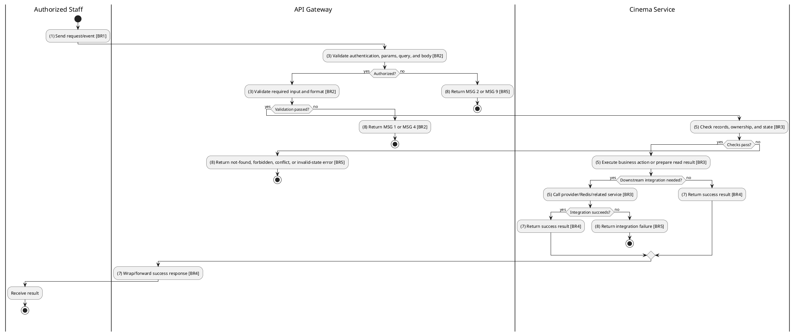
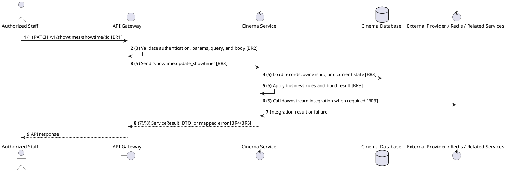

# [ST-05] Update Showtime

## Use Case Description

| Field | Details |
| :--- | :--- |
| **Name** | Update Showtime |
| **Description** | Modifies an existing showtime's details (e.g., changing the hall, start time, or status). |
| **Actor** | Authorized Staff |
| **Trigger** | `PATCH /v1/showtimes/showtime/:id` |
| **Pre-condition** | Caller satisfies gateway auth/permission requirements and request data matches shared DTO/query schema. |
| **Post-condition** | State change is persisted atomically or the request fails without partial data inconsistency. |

## Activities Flow

## Sequence Flow

## Business Rules

| Activity | BR Code | Description |
| :--- | :--- | :--- |
| (1) | BR1 | Loading Screen Rules: ❖ The system loads the "Update Showtime" function and receives the request/event. ❖ The system uses trigger [PATCH /v1/showtimes/showtime/:id]. |
| (3) | BR2 | Validate Rules: ❖ The system checks the items [id], [movieId], [movieReleaseId], [cinemaId], [hallId], [startTime], [format], [language], [subtitles], [status]. ❖ The system validates data according to DTO/schema UpdateShowtimeRequest. ❖ Required fields: [id]. ❖ If any required entries are empty, the system shows error message MSG 1. ❖ Optional fields: [movieId], [movieReleaseId], [cinemaId], [hallId], [startTime], [format], [language], [subtitles], [status]. ❖ Default values: [format] = FormatEnum.TWO_D, [subtitles] = [], [status] = ShowtimeStatusEnum.SELLING. ❖ Field constraint: [id] is required, type string, path parameter. ❖ Field constraint: [movieId] is optional, type string, minimum 1. ❖ Field constraint: [movieReleaseId] is optional, type string, minimum 1. ❖ Field constraint: [cinemaId] is optional, type string, minimum 1. ❖ Field constraint: [hallId] is optional, type string, minimum 1. ❖ Field constraint: [format] is optional, type value, default FormatEnum.TWO_D, allowed values: FormatEnum. ❖ Field constraint: [language] is optional, type value, minimum 1; maximum 10. ❖ Field constraint: [subtitles] is optional, type array<string>, default []. ❖ Field constraint: [status] is optional, type value, default ShowtimeStatusEnum.SELLING, allowed values: ShowtimeStatusEnum. ❖ If any type, format, enum, range, date, UUID, or email constraint is invalid, the system shows error message MSG 4. |
| (5) | BR3 | Updating Rules: ❖ Showtime IDs and filter dates must be parseable; enum fields use FormatEnum and ShowtimeStatusEnum and pagination values are numeric where accepted. ❖ Deleting or cancelling showtimes must respect existing bookings/reservations and service constraints. ❖ Seat map/TTL reads combine persisted showtime/seat data with Redis held-seat state for the requesting user. ❖ Update actions must merge only allowed DTO fields and leave omitted fields unchanged. |
| (7) | BR4 | Message Rules: ❖ Successful write/validation/state-changing operations return service data with MSG 7 where the service wraps a ServiceResult; pure reads return the requested DTO/list. |
| (8) | BR5 | Error Handling Rules: ❖ Showtime create/update must verify referenced movie release, cinema, and hall and reject overlapping hall schedules with the explicit conflict error returned by Showtime Service. ❖ Gateway forwards the request to the target service through microservice pattern showtime.update_showtime and propagates service errors through the common exception layer. ❖ Expected failures include Showtime not found, conflict errors such as Conflict with showtime existing in hall, invalid showtime references, and wrong-cinema forbidden messages. ❖ If a constraint, conflict, or unexpected failure occurs, the system shows error message MSG 9. |
