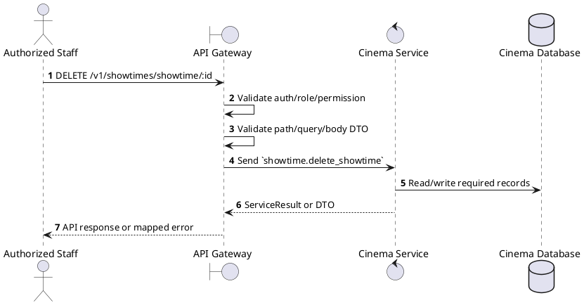
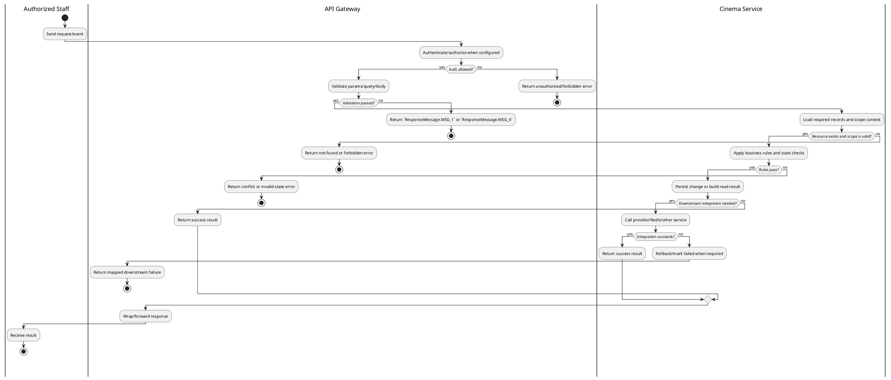

# [ST-06] Delete Showtime

## 1. Description

| Field | Details |
| :--- | :--- |
| **Name** | Delete Showtime |
| **Functional ID** | ST-06 |
| **Description** | Removes a scheduled showtime from the system. |
| **Actor** | Authorized Staff |
| **Trigger** | `DELETE /v1/showtimes/showtime/:id` |
| **Pre-condition** | Caller satisfies gateway auth/permission requirements and request data matches shared DTO/query schema. |
| **Post-condition** | State change is persisted atomically or the request fails without partial data inconsistency. |

## 2. Sequence Flow

## 3. Activity Flow

## 4. Business Rules

| Activity Step | Rule ID | Description |
| :--- | :--- | :--- |
| Gateway guard | BR-ST-06-01 | Request must pass ClerkAuthGuard and the configured Permission decorator before the gateway forwards the command. |
| Input validation | BR-ST-06-02 | Showtime IDs and filter dates must be parseable; enum fields use FormatEnum and ShowtimeStatusEnum and pagination values are numeric where accepted. |
| Route/message boundary | BR-ST-06-03 | Implemented trigger is `DELETE /v1/showtimes/showtime/:id` and service boundary uses `showtime.delete_showtime`; the gateway must not call stale or pluralized paths that differ from the controller. |
| Business/state rule | BR-ST-06-04 | Showtime create/update must verify referenced movie release, cinema, and hall and reject overlapping hall schedules with the explicit conflict error returned by Showtime Service. |
| Business/state rule | BR-ST-06-05 | Managers are limited to their own cinema; gateway overwrites or checks cinemaId from staff context before dispatch. |
| Business/state rule | BR-ST-06-06 | Deleting or cancelling showtimes must respect existing bookings/reservations and service constraints. |
| Business/state rule | BR-ST-06-07 | Seat map/TTL reads combine persisted showtime/seat data with Redis held-seat state for the requesting user. |
| Business/state rule | BR-ST-06-08 | Delete/cancel actions must be blocked when dependent records or invalid terminal states would cause data inconsistency. |
| Integration constraint | BR-ST-06-09 | Gateway forwards the request to the target service through microservice pattern `showtime.delete_showtime` and propagates service errors through the common exception layer. |
| Success response | BR-ST-06-10 | Successful write/validation/state-changing operations return service data with `ResponseMessage.MSG_7` where the service wraps a ServiceResult; pure reads return the requested DTO/list. |
| Failure response | BR-ST-06-11 | Expected failures include `Showtime not found`, conflict errors such as `Conflict with showtime existing in hall`, invalid showtime references, and wrong-cinema forbidden messages. |
