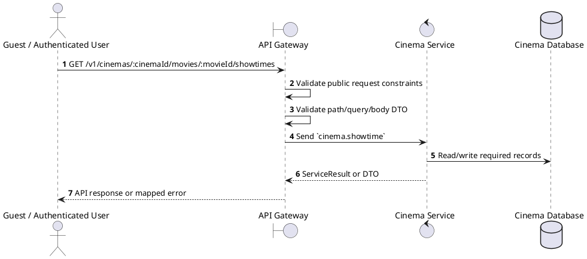
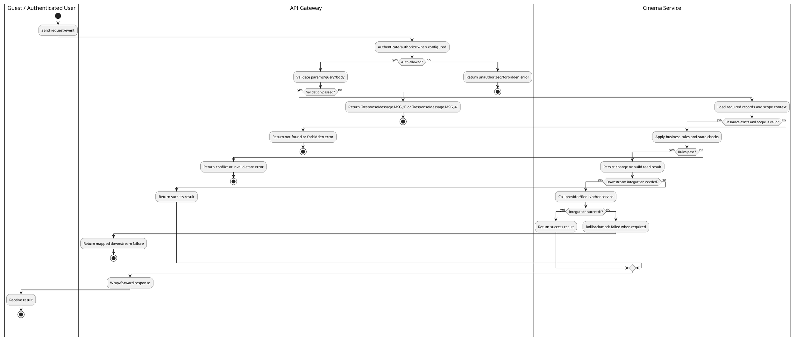

# [ST-07] Get Movie Showtimes at Cinema

## 1. Description

| Field | Details |
| :--- | :--- |
| **Name** | Get Movie Showtimes at Cinema |
| **Functional ID** | ST-07 |
| **Description** | Retrieves all available showtimes for a specific movie at a specific cinema location. |
| **Actor** | Guest / Authenticated User |
| **Trigger** | `GET /v1/cinemas/:cinemaId/movies/:movieId/showtimes` |
| **Pre-condition** | Required path/query parameters are provided; no customer session is required for this read. |
| **Post-condition** | Requested data is returned or the targeted state change is persisted consistently. |

## 2. Sequence Flow

## 3. Activity Flow

## 4. Business Rules

| Activity Step | Rule ID | Description |
| :--- | :--- | :--- |
| Gateway guard | BR-ST-07-01 | Endpoint is callable without a customer session; any staff context added by the gateway can narrow the returned data. |
| Input validation | BR-ST-07-02 | Showtime IDs and filter dates must be parseable; enum fields use FormatEnum and ShowtimeStatusEnum and pagination values are numeric where accepted. |
| Route/message boundary | BR-ST-07-03 | Implemented trigger is `GET /v1/cinemas/:cinemaId/movies/:movieId/showtimes` and service boundary uses `cinema.showtime`; the gateway must not call stale or pluralized paths that differ from the controller. |
| Business/state rule | BR-ST-07-04 | Showtime create/update must verify referenced movie release, cinema, and hall and reject overlapping hall schedules with the explicit conflict error returned by Showtime Service. |
| Business/state rule | BR-ST-07-05 | Managers are limited to their own cinema; gateway overwrites or checks cinemaId from staff context before dispatch. |
| Business/state rule | BR-ST-07-06 | Deleting or cancelling showtimes must respect existing bookings/reservations and service constraints. |
| Business/state rule | BR-ST-07-07 | Seat map/TTL reads combine persisted showtime/seat data with Redis held-seat state for the requesting user. |
| Integration constraint | BR-ST-07-08 | Gateway forwards the request to the target service through microservice pattern `cinema.showtime` and propagates service errors through the common exception layer. |
| Success response | BR-ST-07-09 | Successful read operations return the requested DTO/list using the gateway's normal response wrapper; no artificial success text is invented by the spec. |
| Failure response | BR-ST-07-10 | Expected failures include `Showtime not found`, conflict errors such as `Conflict with showtime existing in hall`, invalid showtime references, and wrong-cinema forbidden messages. |
