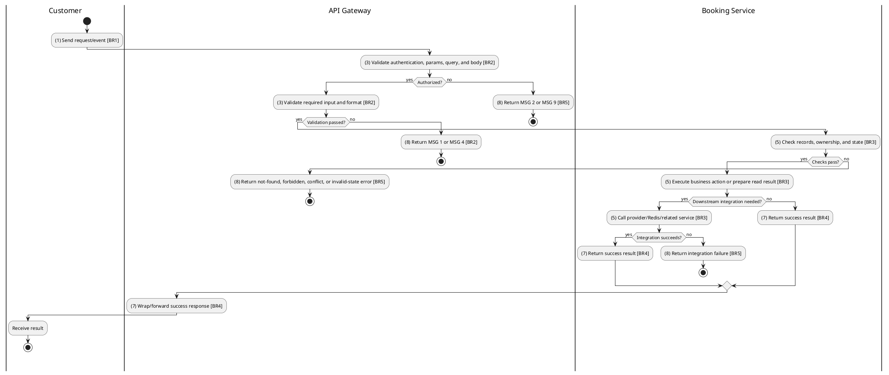
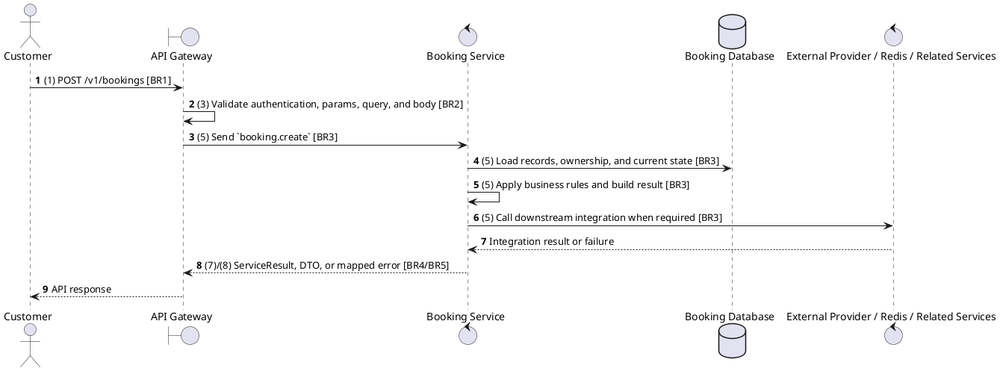

# [BK-01] Create Booking

## Use Case Description

| Field | Details |
| :--- | :--- |
| **Name** | Create Booking |
| **Description** | Initiates a new booking for a specific showtime and set of held seats. |
| **Actor** | Customer |
| **Trigger** | `POST /v1/bookings` |
| **Pre-condition** | Customer or staff has access to the booking context; showtime, seat, payment, and refund prerequisites are valid for the requested action. |
| **Post-condition** | State change is persisted atomically or the request fails without partial data inconsistency. |

## Activities Flow

## Sequence Flow

## Business Rules

| Activity | BR Code | Description |
| :--- | :--- | :--- |
| (1) | BR1 | Loading Screen Rules: ❖ The system loads the "Create Booking" function and receives the request/event. ❖ The system uses trigger [POST /v1/bookings]. |
| (3) | BR2 | Validate Rules: ❖ The system checks the items [showtimeId], [seats], [concessions], [promotionCode], [usePoints], [customerInfo]. ❖ The system validates data according to DTO/schema CreateBookingDto. ❖ Required fields: [showtimeId]. ❖ If any required entries are empty, the system shows error message MSG 1. ❖ Optional fields: [seats], [concessions], [promotionCode], [usePoints], [customerInfo]. ❖ Field constraint: [showtimeId] is required, type string. ❖ Field constraint: [seats] is optional, type SeatBookingDto[], nested fields: seatId, ticketType. ❖ Field constraint: [concessions] is optional, type ConcessionItemDto[], nested fields: concessionId, quantity. ❖ Field constraint: [promotionCode] is optional, type string. ❖ Field constraint: [usePoints] is optional, type number. ❖ Field constraint: [customerInfo] is optional, type CustomerInfoDto, nested fields: name, email, phone. ❖ If any type, format, enum, range, date, UUID, or email constraint is invalid, the system shows error message MSG 4. |
| (5) | BR3 | Creating Rules: ❖ Booking state transitions are limited to PENDING -> CONFIRMED/CANCELLED/EXPIRED, CONFIRMED -> COMPLETED/CANCELLED/REFUNDED; terminal states do not regress. ❖ Seat availability is derived from held Redis seats and persisted seat reservations; duplicate or expired holds must fail without creating inconsistent tickets. ❖ Refund/cancellation functions must use the configured cancellation policy, showtime timing, payment status, and refund percentage before changing booking state. ❖ Integration may call Cinema Service for showtime/seat context, User Service for customer data, payment/ticket/refund modules for state consistency, and uses microservice pattern booking.create. ❖ Create actions must reject duplicate/conflicting records before persistence and return the created DTO after persistence. |
| (7) | BR4 | Message Rules: ❖ Successful write/validation/state-changing operations return service data with MSG 7 where the service wraps a ServiceResult; pure reads return the requested DTO/list. |
| (8) | BR5 | Error Handling Rules: ❖ Expected failures include Booking not found, Cannot cancel this booking, Can only update pending bookings, Cannot reschedule cancelled booking, Cannot reschedule completed booking, invalid/expired promotion, loyalty balance errors, and downstream cinema lookup failures. ❖ If a constraint, conflict, or unexpected failure occurs, the system shows error message MSG 9. |
