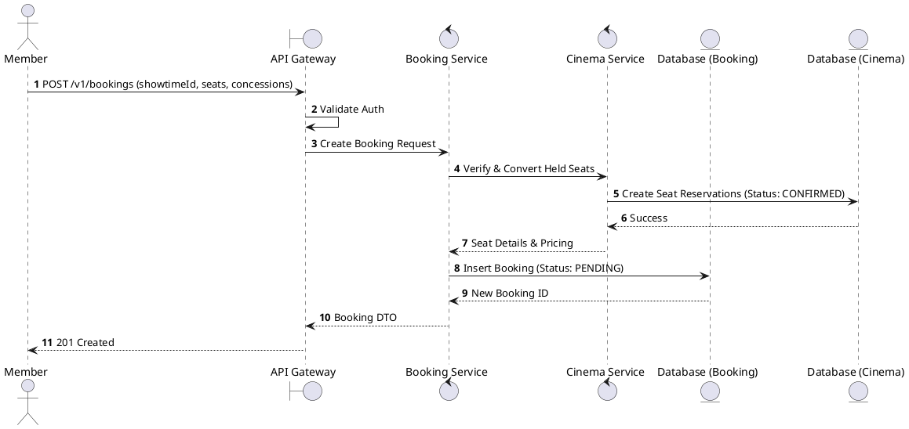
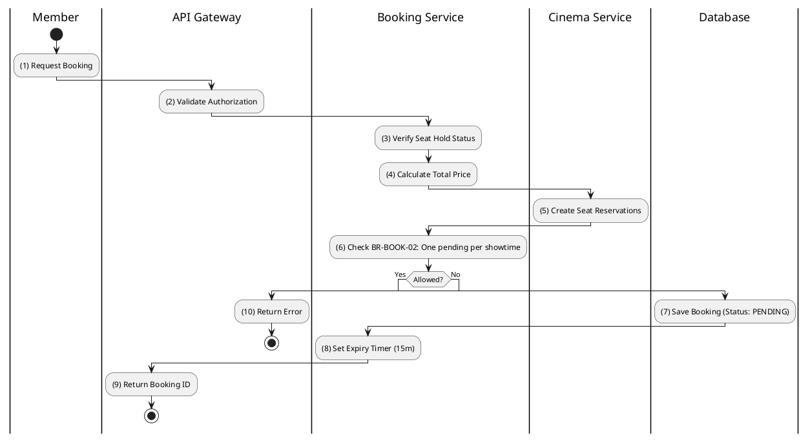

# [BK-01] Create Booking

## 1. Description

| Field | Details |
| :--- | :--- |
| **Name** | Create Booking |
| **Functional ID** | BK-01 |
| **Description** | Initiates a new booking for a specific showtime and set of held seats. |
| **Actor** | Member |
| **Trigger** | `POST /v1/bookings` |
| **Pre-condition** | Member authenticated; Seats held in Redis; Showtime is active. |
| **Post-condition** | Booking created with status `PENDING`; Expiry timer started. |

## 2. Sequence Flow

## 3. Activity Flow

## 4. Business Rules

| Activity Step | Rule ID | Description |
| :--- | :--- | :--- |
| (3) | BR104 | Member must have an authenticated session before a booking session is created. |
| (3) | BR105 | Seats must be held by the same user in Redis before tickets can be attached to the booking. |
| (6) | BR106 | Only one active `PENDING` booking per user per showtime is allowed; existing pending bookings are reused. |
| (7) | BR107 | New bookings start with `PENDING` booking status and `PENDING` payment status. |
| (8) | BR108 | Booking payment window expires after 15 minutes or when the seat hold TTL expires, whichever is earlier. |
| (4) | BR109 | Amounts are calculated from current seat prices, concessions, promotions, loyalty discounts, and 10% VAT policy. |
| (9) | BR110 | Booking creation must return enough summary data for checkout without exposing internal database fields. |

