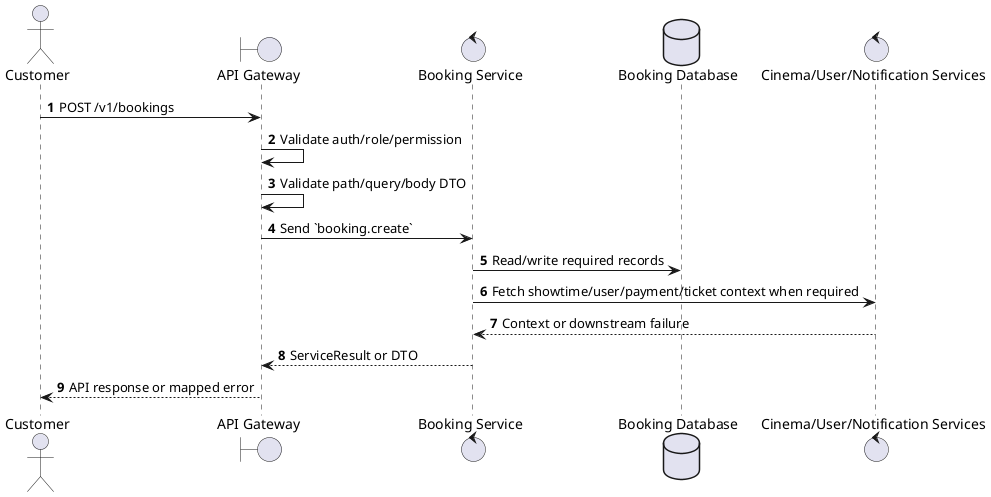
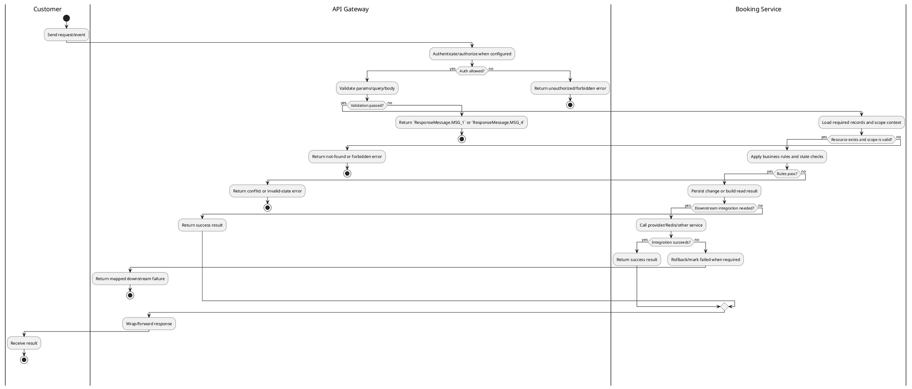

# [BK-01] Create Booking

## 1. Description

| Field | Details |
| :--- | :--- |
| **Name** | Create Booking |
| **Functional ID** | BK-01 |
| **Description** | Initiates a new booking for a specific showtime and set of held seats. |
| **Actor** | Customer |
| **Trigger** | `POST /v1/bookings` |
| **Pre-condition** | Customer or staff has access to the booking context; showtime, seat, payment, and refund prerequisites are valid for the requested action. |
| **Post-condition** | State change is persisted atomically or the request fails without partial data inconsistency. |

## 2. Sequence Flow

## 3. Activity Flow

## 4. Business Rules

| Activity Step | Rule ID | Description |
| :--- | :--- | :--- |
| Gateway guard | BR-BK-01-01 | Customer request must pass ClerkAuthGuard; own-scope permissions and ownership checks prevent access to another user's booking, payment, ticket, loyalty, or refund data. |
| Input validation | BR-BK-01-02 | CreateBookingDto requires `showtimeId`; `seats` is optional ticket-type metadata because actual held seats are read from Redis; concessions require `concessionId` and positive `quantity`; loyalty points and promotion code are optional. |
| Route/message boundary | BR-BK-01-03 | Implemented trigger is `POST /v1/bookings` and service boundary uses `booking.create`; the gateway must not call stale or pluralized paths that differ from the controller. |
| Business/state rule | BR-BK-01-04 | Booking ownership is enforced for customer endpoints; admin endpoints are scoped by cinema context when the authenticated staff account has a cinema assignment. |
| Business/state rule | BR-BK-01-05 | Booking state transitions are limited to `PENDING -> CONFIRMED/CANCELLED/EXPIRED`, `CONFIRMED -> COMPLETED/CANCELLED/REFUNDED`; terminal states do not regress. |
| Business/state rule | BR-BK-01-06 | Seat availability is derived from held Redis seats and persisted seat reservations; duplicate or expired holds must fail without creating inconsistent tickets. |
| Business/state rule | BR-BK-01-07 | Refund/cancellation functions must use the configured cancellation policy, showtime timing, payment status, and refund percentage before changing booking state. |
| Business/state rule | BR-BK-01-08 | Create actions must reject duplicate/conflicting records before persistence and return the created DTO after persistence. |
| Integration constraint | BR-BK-01-09 | Integration may call Cinema Service for showtime/seat context, User Service for customer data, payment/ticket/refund modules for state consistency, and uses microservice pattern `booking.create`. |
| Success response | BR-BK-01-10 | Successful write/validation/state-changing operations return service data with `ResponseMessage.MSG_7` where the service wraps a ServiceResult; pure reads return the requested DTO/list. |
| Failure response | BR-BK-01-11 | Expected failures include `Booking not found`, `Cannot cancel this booking`, `Can only update pending bookings`, `Cannot reschedule cancelled booking`, `Cannot reschedule completed booking`, invalid/expired promotion, loyalty balance errors, and downstream cinema lookup failures. |
