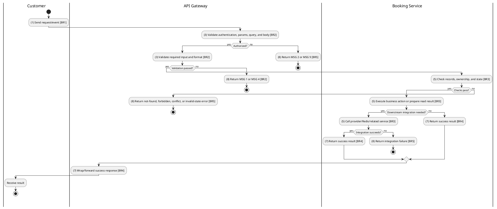
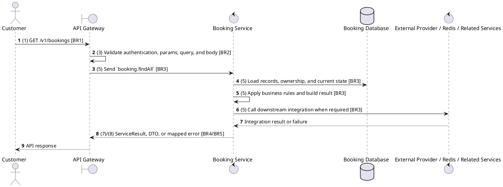

# [BK-02] List User Bookings

## Use Case Description

| Field | Details |
| :--- | :--- |
| **Name** | List User Bookings |
| **Description** | Retrieves the booking history for the authenticated member. |
| **Actor** | Customer |
| **Trigger** | `GET /v1/bookings` |
| **Pre-condition** | Customer or staff has access to the booking context; showtime, seat, payment, and refund prerequisites are valid for the requested action. |
| **Post-condition** | Booking status/payment/ticket/refund data remains consistent with the performed operation. |

## Activities Flow

## Sequence Flow

## Business Rules

| Activity | BR Code | Description |
| :--- | :--- | :--- |
| (1) | BR1 | Loading Screen Rules: ❖ The system loads the "List User Bookings" function and receives the request/event. ❖ The system uses trigger [GET /v1/bookings]. |
| (3) | BR2 | Validate Rules: ❖ The system checks the items [status], [page], [limit]. ❖ The system validates data according to DTO/schema PaginationQuery. ❖ Optional fields: [status], [page], [limit]. ❖ Field constraint: [status] is optional, type BookingStatus, query parameter. ❖ Field constraint: [page] is optional, type number. ❖ Field constraint: [limit] is optional, type number. ❖ If any type, format, enum, range, date, UUID, or email constraint is invalid, the system shows error message MSG 4. |
| (5) | BR3 | Retrieval Rules: ❖ Path and query IDs must identify existing bookings/showtimes; status filters use BookingStatus and PaymentStatus enums, and pagination/date query values must be parseable before service dispatch. ❖ Booking state transitions are limited to PENDING -> CONFIRMED/CANCELLED/EXPIRED, CONFIRMED -> COMPLETED/CANCELLED/REFUNDED; terminal states do not regress. ❖ Seat availability is derived from held Redis seats and persisted seat reservations; duplicate or expired holds must fail without creating inconsistent tickets. ❖ Refund/cancellation functions must use the configured cancellation policy, showtime timing, payment status, and refund percentage before changing booking state. ❖ List responses must honor supported filters, pagination defaults, and cinema/user scoping before returning data. ❖ Integration may call Cinema Service for showtime/seat context, User Service for customer data, payment/ticket/refund modules for state consistency, and uses microservice pattern booking.findAll. |
| (7) | BR4 | Message Rules: ❖ Successful write/validation/state-changing operations return service data with MSG 7 where the service wraps a ServiceResult; pure reads return the requested DTO/list. |
| (8) | BR5 | Error Handling Rules: ❖ Expected failures include Booking not found, Cannot cancel this booking, Can only update pending bookings, Cannot reschedule cancelled booking, Cannot reschedule completed booking, invalid/expired promotion, loyalty balance errors, and downstream cinema lookup failures. ❖ If a constraint, conflict, or unexpected failure occurs, the system shows error message MSG 9. |
