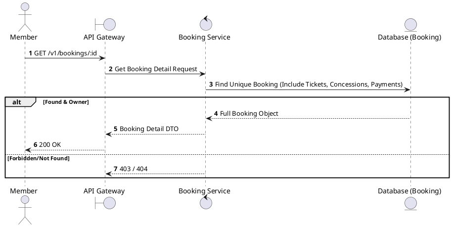
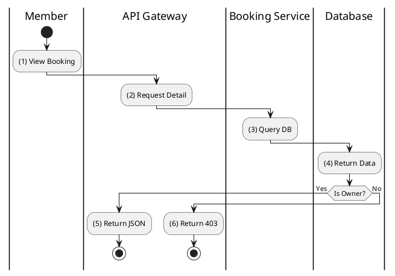

# [BK-03] Get Booking Details

## 1. Description

| Field | Details |
| :--- | :--- |
| **Name** | Get Booking Details |
| **Functional ID** | BK-03 |
| **Description** | Retrieves full details of a specific booking, including tickets, concessions, and payment status. |
| **Actor** | Member |
| **Trigger** | `GET /v1/bookings/:id` |
| **Pre-condition** | Member authenticated; Booking ID exists and belongs to the member. |
| **Post-condition** | Full booking object returned. |

## 2. Sequence Flow

## 3. Activity Flow

## 4. Business Rules

| Activity Step | Rule ID | Description |
| :--- | :--- | :--- |
| (2) | BR117 | Member must be authenticated and can only access bookings they own. |
| (3) | BR118 | Details must hydrate booking, tickets, concessions, payment status, promotion, refund voucher, and showtime context where available. |
| (3) | BR119 | Confirmed bookings must expose enough ticket data for QR display or QR regeneration. |
| (3) | BR120 | QR references must be unique per ticket and must not expose mutable payment or user PII. |
| (5) | BR121 | The response must use stable DTO fields so tickets remain downloadable and viewable after payment confirmation. |
| (6) | BR122 | Unauthorized or missing bookings must return not found/forbidden without disclosing another user's booking existence. |

