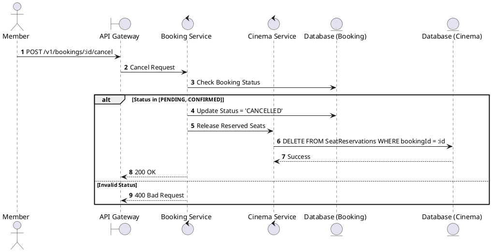
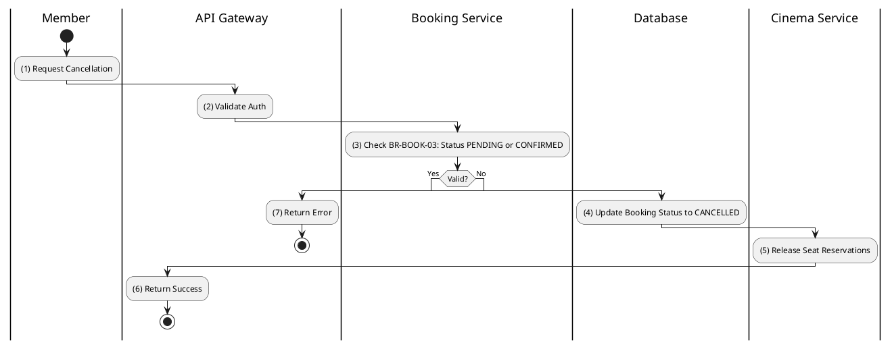

# [BK-05] Cancel Booking

## 1. Description

| Field | Details |
| :--- | :--- |
| **Name** | Cancel Booking |
| **Functional ID** | BK-05 |
| **Description** | Cancels a PENDING booking before payment or a CONFIRMED booking (without refund logic here, see BK-09 for refund). |
| **Actor** | Member |
| **Trigger** | `POST /v1/bookings/:id/cancel` |
| **Pre-condition** | Booking belongs to Member; Status is PENDING or CONFIRMED. |
| **Post-condition** | Booking status set to `CANCELLED`; Seats released. |

## 2. Sequence Flow

## 3. Activity Flow

## 4. Business Rules

| Activity Step | Rule ID | Description |
| :--- | :--- | :--- |
| (2) | BR128 | The requester must be authenticated and must own the booking before cancellation is allowed. |
| (3) | BR129 | Bookings can only be cancelled when status is `PENDING` or `CONFIRMED`; terminal bookings cannot be cancelled again. |
| (4) | BR130 | Cancellation must be atomic with booking status, ticket status, cancellation reason, and cancellation timestamp updates. |
| (5) | BR131 | Seats from a cancelled pending booking must be released for other users as soon as the cancellation succeeds. |
| (5) | BR132 | Confirmed booking cancellation that requires refund handling must follow refund policy in BK-09/RF module. |
| (6) | BR133 | Cancellation should return clear user-facing status and must not leave booking, ticket, and payment states inconsistent. |

